# 6.828

[TOC]

## lab1: Booting a PC

* 配置环境花了不少时间，建议先直接参考“References”，实在不行再Google

### Part1 : PC Bootstrap

* 先熟悉下 x86 assembly，大致过一遍就行，太深入的话会感觉直接劝退，后面有需要再来查

* 在shell里type "Ctrl+a x"才有用，黑框框里的不行

* 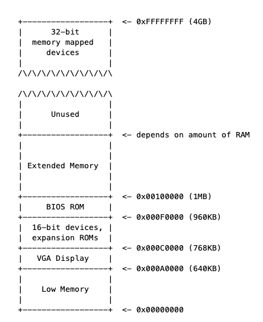 

* 早期的pc，16位，可用的物理地址为1M(0x00000000~0x000FFFFF)，random-access memory(RAM)为640KB(Low Memory)

* 最重要的部分是BIOS，在0x000F0000~0x000FFFFF。早期的PC中，BIOS保存在read-only memory(ROM)中，现在的PC机将BIOS存储在updateable flash memory中

* BIOS负责执行基本的系统初始化，如激活显卡和检查已安装的内存数量。在执行这些初始化后，BIOS从某些适当的位置(如 floppy disk， hard disk，CD-ROM，the network)加载操作系统

* 现在处理器支持4GB的物理空间，但还是保留1MB的物理地址的设定来向后兼容，因此会有"hole"

* 实模式下，地址20位（2^20=1MB）而寄存器都是16位，如何表示这20位的地址呢：`physical address = 16 * segment + offset`（把段地址左移4位加上段内偏移地址）

* 第一条指令，[f000:fff0] 0xffff0:    ljmp   
  
  * PC 在物理地址0x000ffff0，在ROM BIOS保留的64KB的非常高的位置
  
  * 以CS(CS 就是代码段寄存器（Code Segment Register），通过它可以找到代码在内存中的位置) = 0xf000 和IP(IP 寄存器就是指令指针寄存器（Instruction Pointer Register)，指向代码段中下一条指令的位置) = 0xfff0 开始执行
  
  * 第一条命令为jump ，jump到BIOS前面的位置

* 持续使用si进行跟踪代码时，会发现很多完全不懂的跳转，大部分都在设置devices，比如VGA，需要查阅“I/O Ports Decsription”，跟lab主旨无关，大致知道就行

### Part 2 ：The Boot Loader

* pc机的Floppy and hard disks 被划分为512字节的 sectors(扇区)。扇区是磁盘的最小传输粒度:每个读或写操作的大小必须是一个或多个扇区，并且在扇区边界上对齐。如果磁盘是可引导的，则第一个扇区称为**the boot sector**(引导扇区)

* BIOS找到一个可引导的软盘或硬盘，它将512字节的引导扇区加载到物理地址0x7c00到0x7dff的内存中，然后使用jmp指令将CS:IP设置为0000:7c00，将控制权传递给**the boot loader**

* 将处理器从16位的实模式切换到32位保护模式，使得1M以上的内存地址可以访问(主要在boot.S完成)

* 通过x86特定的I/O指令直接访问 IDE disk device registers，从而**从硬盘中读取内核** （主要main.c完成，还会跳转到内核入口地址）

##### Exercise 3

* 关闭中断(cli)，设置方向标识(cld)，初始化segment register

```asm
.globl start
start:
  .code16                     # Assemble for 16-bit mode
  cli                         # Disable interrupts
    7c00:    fa                       cli    
  cld                         # String operations increment
    7c01:    fc                       cld    

  # Set up the important data segment registers (DS, ES, SS).
  xorw    %ax,%ax             # Segment number zero
    7c02:    31 c0                    xor    %eax,%eax
  movw    %ax,%ds             # -> Data Segment
    7c04:    8e d8                    mov    %eax,%ds
  movw    %ax,%es             # -> Extra Segment
    7c06:    8e c0                    mov    %eax,%es
  movw    %ax,%ss             # -> Stack Segment
    7c08:    8e d0                    mov    %eax,%ss
```

**准备**把CPU的工作模式从16位实模式转换为32位保护模式，使得1M以上的内存地址可以访问。D1指令代表下一次写入0x60端口的数据将被写入给804x控制器的输出端口，跳转判断就是看D1是否被取走，DF类似(A20 gate的规定)

```asm
# write output port. next byte written  to 0060 will be written to the 804x output port; 
# the original IBM AT and many compatibles use bit 1 of
# the output port to control the A20 gate.

seta20.1:
  inb     $0x64,%al               # Wait for not busy
    7c0a:    e4 64                    in     $0x64,%al
  testb   $0x2,%al
    7c0c:    a8 02                    test   $0x2,%al
  jnz     seta20.1
    7c0e:    75 fa                    jne    7c0a <seta20.1>

  movb    $0xd1,%al               # 0xd1 -> port 0x64
    7c10:    b0 d1                    mov    $0xd1,%al
  outb    %al,$0x64
    7c12:    e6 64                    out    %al,$0x64

00007c14 <seta20.2>:

seta20.2:
  inb     $0x64,%al               # Wait for not busy
    7c14:    e4 64                    in     $0x64,%al
  testb   $0x2,%al
    7c16:    a8 02                    test   $0x2,%al
  jnz     seta20.2
    7c18:    75 fa                    jne    7c14 <seta20.2>
# 0064 w enable address line A20 (KB controller commands (data goes to port 0060))
  movb    $0xdf,%al               # 0xdf -> port 0x60
    7c1a:    b0 df                    mov    $0xdf,%al
  outb    %al,$0x60
    7c1c:    e6 60                    out    %al,$0x60
```

* 加载全局描述符寄存器GDTR，GDT表是处理器在保护模式下非常重要的一个表。后面是在把CR0寄存器的bit0置1，CR0寄存器的bit0是保护模式启动位，把这一位值1代表保护模式启动。之后必须重新加载所有段寄存器的值，GDTR值才能生效
  
  lgdtw 0x7c64 : 这条指令是把指令后面的值所指定内存地址0x7c64处后6个字节的值输入全局描述符表寄存器GDTR
  
  ```asm6502
   # Load Global Descriptor Table Register
   # gdtdesc:
   #  .word   0x17             
   #  .long   gdt   
   #  其中.word为2字节，存放gdt表的大小，.long为四字节，存放gdt的地址
   # 参考inc/mmu.h中两段宏,定义了三个Segment Register
   # To enter protected mode, the Global Descriptor Table (GDT) must first be created with a minimum of three entries: // a null descriptor, a code segment descriptor and data segment descriptor. 
   # https://en.wikipedia.org/wiki/Protected_mode#Segment_addressing
  ```
  
  Switch from real to protected mode, using a bootstrap GDT and segment translation that makes virtual addresses
  
  identical to their physical addresses, so that the effective memory map does not change during the switch.
  
  lgdtw  0x7c64
  
    lgdt    gdtdesc
  
  ```asm
  7c1e:    0f 01 16                 lgdtl  (%esi)
  7c21:    64 7c 0f                 fs jl  7c33 <protcseg+0x1>
  ```
  
    movl    %cr0, %eax
  
  ```asm
  7c24:    20 c0                    and    %al,%al
  ```
  
    orl     $CR0_PE_ON, %eax
  
  ```asm
  7c26:    66 83 c8 01              or     $0x1,%ax
  ```
  
    movl    %eax, %cr0
  
  ```asm
  7c2a:    0f 22 c0                 mov    %eax,%cr0
  ```
  
  Jump to next instruction, but in 32-bit code segment.
  
  Switches processor into 32-bit mode.
  
    ljmp    $PROT_MODE_CSEG, $protcseg # ljmp $PROT_MODE_CSEG, $protcseg 保护模式下的cs 为0x8
  
  ```asm
  7c2d:    ea                       .byte 0xea
  7c2e:    32 7c 08 00              xor    0x0(%eax,%ecx,1),%bh
  ```
  
  00007c32 <protcseg>:
  
    .code32                     # Assemble for 32-bit mode
  
  protcseg:
  
  Set up the protected-mode data segment registers
  
    movw    $PROT_MODE_DSEG, %ax    # Our data segment selector
  
  ```asm
  7c32:    66 b8 10 00              mov    $0x10,%ax # 将ax设置为0x10并且赋值到ds,es,fs,gs,ss段寄存器
  ```
  
    movw    %ax, %ds                # -> DS: Data Segment
  
  ```asm
  7c36:    8e d8                    mov    %eax,%ds
  ```
  
    movw    %ax, %es                # -> ES: Extra Segment
  
  ```asm
  7c38:    8e c0                    mov    %eax,%es
  ```
  
    movw    %ax, %fs                # -> FS
  
  ```asm
  7c3a:    8e e0                    mov    %eax,%fs
  ```
  
    movw    %ax, %gs                # -> GS
  
  ```asm
  7c3c:    8e e8                    mov    %eax,%gs
  ```
  
    movw    %ax, %ss                # -> SS: Stack Segment
  
  ```asm
  7c3e:    8e d0                    mov    %eax,%ss
  ```
  
  0x10 和0x8 都是logical address(16-bit visible selector + hidden descriptor)

selector 15~3(index)3~2(Table Indicator)2~0(Requestor's privilege level)

所以 0x10(000 0000 00010  0  00),0x8(000 0000 00001  0  00)

```c
* main.c

```c
    struct Proghdr *ph, *eph;

    // read 1st page off disk
    readseg((uint32_t) ELFHDR, SECTSIZE*8, 0);

    // is this a valid ELF?
    if (ELFHDR->e_magic != ELF_MAGIC)
        goto bad;

    // load each program segment (ignores ph flags)
    ph = (struct Proghdr *) ((uint8_t *) ELFHDR + ELFHDR->e_phoff);
    eph = ph + ELFHDR->e_phnum;
    for (; ph < eph; ph++)
        // p_pa is the load address of this segment (as well
        // as the physical address)
        readseg(ph->p_pa, ph->p_memsz, ph->p_offset);

    // call the entry point from the ELF header
    // note: does not return!
    ((void (*)(void)) (ELFHDR->e_entry))();
```

其中readsect方法，基本按照手册走，还有logical block 寻址计算

```asm
// https://bochs.sourceforge.io/techspec/PORTS.LST

# 01F2    r/w    sector count
outb(0x1F2, 1);        // count = 1
# 01F3    r/w    sector number
outb(0x1F3, offset);
# 01F4    r/w    cylinder low
outb(0x1F4, offset >> 8);
# 01F5    r/w    cylinder high
outb(0x1F5, offset >> 16);
# 01F6    r/w    drive/head
outb(0x1F6, (offset >> 24) | 0xE0);
# 01F7    w    command register read sectors with retry
outb(0x1F7, 0x20);    // cmd 0x20 - read sectors

// https://en.wikipedia.org/wiki/Logical_block_addressing#CHS_conversion
// https://en.wikipedia.org/wiki/Cylinder-head-sector#CHS_to_LBA_mapping
// (sector,head,cylinder) -> Logical block addressing

// edi设置为栈上第一个参数pa，即需要被写入的物理地址
0x7cce:    mov    0x8(%ebp),%edi
// ecx设置为128(SECTSIZE/4)
0x7cd1:    mov    $0x80,%ecx
// edx寄存器设置为磁盘控制器上数据寄存器的端口号
0x7cd6:    mov    $0x1f0,%edx
// Clear Direction Flag DF=0
0x7cdb:    cld
// https://pdos.csail.mit.edu/6.828/2018/readings/i386/s08_02.htm
// ins: transfers a byte or a word string element from an input port to memory
// If a program specifies INSB, the processor transfers 8 bits from the selected port to the memory location indicated by ES:EDI
// https://pdos.csail.mit.edu/6.828/2018/readings/i386/REP.htm
// repnz repeat while not zero
0x7cdc:    repnz insl (%dx),%es:(%edi)
```

#### Loading the Kernel

##### Exercise 4

```c
#include <stdio.h>
#include <stdlib.h>

void
f(void)
{
    int a[4];
    int *b = malloc(16);
    int *c;
    int i;

    printf("1: a = %p, b = %p, c = %p\n", a, b, c);

    c = a;
    for (i = 0; i < 4; i++)
    a[i] = 100 + i;
    c[0] = 200;
    printf("2: a[0] = %d, a[1] = %d, a[2] = %d, a[3] = %d\n",
       a[0], a[1], a[2], a[3]);

    c[1] = 300;
    *(c + 2) = 301;
    3[c] = 302;
    printf("3: a[0] = %d, a[1] = %d, a[2] = %d, a[3] = %d\n",
       a[0], a[1], a[2], a[3]);

    c = c + 1;
    *c = 400;
    printf("4: a[0] = %d, a[1] = %d, a[2] = %d, a[3] = %d\n",
       a[0], a[1], a[2], a[3]);

    c = (int *) ((char *) c + 1);
    *c = 500;
    printf("5: a[0] = %d, a[1] = %d, a[2] = %d, a[3] = %d\n",
       a[0], a[1], a[2], a[3]);

    b = (int *) a + 1;
    c = (int *) ((char *) a + 1);
    printf("6: a = %p, b = %p, c = %p\n", a, b, c);
}

int
main(int ac, char **av)
{
    f();
    return 0;
}
```

这里的5有点难理解

```textile
On a little-endian platform like x86_64 or i386, the process is like that

At the beginning a[0]=200(0XC8),a[1]=400(0X0190),a[2]=301(0X012D),a[3]=302(0X012E)
10                  c                   8                   4                   0
+----+----+----+----+----+----+----+----+----+----+----+----+----+----+----+----+
|       a[3]        |       a[2]        |       a[1]        |       a[0]        |
| 00 | 00 | 01 | 2e | 00 | 00 | 01 | 2d | 00 | 00 | 01 | 90 | 00 | 00 | 00 | c8 |
+----+----+----+----+----+----+----+----+----+----+----+----+----+----+----+----+
                                         ^^^^ ^^^^ ^^^^ ^^^^ c
Cast to char pointer
10                  c                   8                   4                   0
+----+----+----+----+----+----+----+----+----+----+----+----+----+----+----+----+
| 00 | 00 | 01 | 2e | 00 | 00 | 01 | 2d | 00 | 00 | 01 | 90 | 00 | 00 | 00 | c8 |
+----+----+----+----+----+----+----+----+----+----+----+----+----+----+----+----+
                                                        ^^^^ c
Move pointer c to the next
10                  c                   8                   4                   0
+----+----+----+----+----+----+----+----+----+----+----+----+----+----+----+----+
| 00 | 00 | 01 | 2e | 00 | 00 | 01 | 2d | 00 | 00 | 01 | 90 | 00 | 00 | 00 | c8 |
+----+----+----+----+----+----+----+----+----+----+----+----+----+----+----+----+
                                                   ^^^^ c
Cast to int pointer
10                  c                   8                   4                   0
+----+----+----+----+----+----+----+----+----+----+----+----+----+----+----+----+
| 00 | 00 | 01 | 2e | 00 | 00 | 01 | 2d | 00 | 00 | 01 | 90 | 00 | 00 | 00 | c8 |
+----+----+----+----+----+----+----+----+----+----+----+----+----+----+----+----+
                                    ^^^^ ^^^^ ^^^^ ^^^^ c
Assign value *c = 0x000001f4(500)
10                  c                   8                   4                   0
+----+----+----+----+----+----+----+----+----+----+----+----+----+----+----+----+
|       a[1]        |       a[2]        |       a[1]        |       a[0]        |
| 00 | 00 | 01 | 2e | 00 | 00 | 01 | 00 | 00 | 01 | f4 | 90 | 00 | 00 | 00 | c8 |
+----+----+----+----+----+----+----+----+----+----+----+----+----+----+----+----+
                                    ^^^^ ^^^^ ^^^^ ^^^^ c
The final result is:
a[0] == 0xc8 == 200
a[1] == 0x1f490 == 128144
a[2] == 0x100 == 256
a[4] == 0x12e == 302
```

* 理解ELF binary，“Executable and Linkable Format”，linker将所有编译好的object files 放到一个binary image中(比如obj/kern/kernel)，binary的格式为 ELF format

* 更多的信息可以参考reference，但不需要过多深入，复杂的部分都是用来支持dynamic loading of shared libraries，jos用不上

* ELF中我们需要关注的，.text：程序的执行指令，.rodata：只读 data，比如由C编译器生成的ASCII 字符常量，.data：程序的初始化值，比如全局变量初始化 int x = 5，linker为未初始化的全局变量，比如int x 保留的空间，为.bss，在.data后面

* main.c中，每个程序头的 ph-> p _ pa 字段包含段(segment)的目标物理地址

##### Exercise 5

-Ttext 后面的数字改为其它，一直到lgdtw前都不会出问题，之后会出现GDT表加载错误，因为加载信息错了

##### Exercise 6

刚进入bootloader时，内存位置均为0，进入kernel时，内存数据如下

> ```text
> (gdb) x/8x 0x100000
> 0x100000:    0x1badb002    0x00000000    0xe4524ffe    0x7205c766
> 0x100010:    0x34000004    0x2000b812    0x220f0011    0xc0200fd8
> ```

这些数据为bootloader所加载的.text 

### Part3：The Kernel

* boot loader‘s link 和 load地址是一样的，但是在kernel中这两个有一段差距。早kernel.ld中，link address = 0xF0100000，load address= 0x100000

* 操作系统通常使用linked 和 run 在非常高的virtual address，为了让用户程序使用处理器的虚拟地址空间的较低部分

* map virtual address 0xf0100000到physical address 0x00100000。通过这种方式，尽管内核的虚拟地址足够高，为用户进程留下了足够的地址空间，但是它将被加载到物理内存中的 PC 内存中的1 MB 位置，就在 BIOS ROM 上方

* 在 kern/entry.S 设置 CR0 _ PG 标志之前，内存引用被视为物理地址(严格地说，它们是线性地址，但是 boot/boot.S 设置了从线性地址(linear addresses)到物理地址的身份映射，我们永远不会改变这一点，即里面设置的GDT)。

##### Exercise 7

movl %eax, %cr0指令之后，0x00100000与0xf0100000后4个字完全相同了，我认为是分页后，0x00100000映射到了0xf0100000，完成了分页操作。

先make clean 再注释掉movl %eax, %cr0后，重新编译调试，断点设在0x0010000c处，一步一步运行，在movl $(bootstacktop),%esp指令处出错了。没有分页，不能访问0xf010002c，即访问的逻辑地址超出内存了

#### Formatted Printing to the Console

##### Exercise 8

kern/console.c 定义了如何把一个字符显示到console上，包括很多对IO端的操作

lib/printfmt.c 在编程时直接利用printf函数向屏幕输出信息

kern/printf.c 在编程中会用到的最顶层的一些格式化输出子程序

printfmt.c 调用printf.c中的putch函数
console.c调用printf.c中的cprintf函数
printf.c又调用printfmt.c的vprintfmt函数 以及 console.c中的cputchar函数

cputchar函数：打印一个字符到显示屏上
putch函数：调用cputchar函数，并记录一共打印了多少字符
vprintfmt函数：将参数fmt(eg. “%s have %d num”, s,n)打印，并将其中的转义字符(%s,%d)用对应参数(s,n)代替
cprintf函数：类似标准输出。有多个输入参数，调用vcprintf函数，vcprintf函数再调用vprintfmt函数实现打印。

question:

1. console.c中没被static修饰的函数都可被其他文件调用，其中，cputchar子函数被printf.c在putch函数中调用了

2. ```c
   //crt_pos 当前字符将要输入的位置
   //CRT_SIZE 能显示的最大字符数
   if (crt_pos >= CRT_SIZE) {
           int i;
           //将当前显示的内容全部往上滚动一行，留出一行空地
           memmove(crt_buf, crt_buf + CRT_COLS, (CRT_SIZE - CRT_COLS) * sizeof(uint16_t));
           for (i = CRT_SIZE - CRT_COLS; i < CRT_SIZE; i++)  
                   crt_buf[i] = 0x0700 | ' ';
           crt_pos -= CRT_COLS;
   }
   ```

3. `fmt`指向字符串`"x %d, y %x, z %d\n"`，也即`8(%ebp)`位置处的第一个参数。`ap`指向可变参数列表，也即`12(%ebp)`位置处的第二个参数
   
   ```C
   vcprintf("x %d, y %x, z %d\n", va_list{x, y, z})
   cons_putc('x')
   cons_putc(' ')
   va_arg, ap: va_list{x, y, z} => va_list{y, z}
   cons_putc('1')
   cons_putc(',')
   cons_putc(' ')
   cons_putc('y')
   cons_putc(' ')
   va_arg, ap: va_list{y, z} => va_list{z}
   cons_putc('3')
   cons_putc(',')
   cons_putc(' ')
   cons_putc('z')
   cons_putc(' ')
   va_arg, ap: va_list{z} => va_list{}
   cons_putc('4')
   cons_putc('4')
   cons_putc('\n')
   ```

4. 输出为`He110 World`
   
   57616的16进制表示为110，而十六进制数72,6c,64在ASCII码中对应的字符分别为r, l, d
   
   若为大端，则只需令`i = 0x726c6400`，无需改动57616

5. 将会输出`12(%ebp)`处的值

6. 将其改为
   
   ```c
   cprintf(..., int n, const char* fmt)
   // n 为可变参数的个数 
   ```

#### The Stack

##### Exercise 9

```asm
    # Clear the frame pointer register (EBP)
    # so that once we get into debugging C code,
    # stack backtraces will be terminated properly.
    movl    $0x0,%ebp            # nuke frame pointer

    # Set the stack pointer
    movl    $(bootstacktop),%esp
```

入口处断点，跟随几条命令后，mov 0x0, mov 0xf0110000,%esp
call 0xf0100094 <i386_init>
esp指向栈顶指针,entry.S最后定义了bootstrap的大小KSTKSIZE = 8 * PGSIZE = 8 * 4096 =32KB 所以堆栈位于内存的0x0010800 ~ 0x0011000,堆栈向下增长,esp指向栈顶

* esp: stack pointer 指向stack的最低点，push值后，减少esp，pop值后，增加esp

* ebp: base pointer 它主要通过软件约定与堆栈相关联

* 每个函数调用时，父函数先将参数压栈，使用call命令的时候，将eip(instruction pointer. It points to (holds the address of) the first byte of the next instruction to be executed.)压栈。然后进入子函数的时候，将原来的ebp压栈，把esp赋值给ebp，此时两寄存器都指向同一个地址。
  接下来，子函数为程序分配内存空间，栈向下增长，即将esp减去一个值
  
  ```textile
  +-----+
  | ... |
  +-----+
  | arg3|
  +-----+
  | arg2|
  +-----+
  | arg1|
  +-----+
  | eip |
  +-----+
  | ebp |
  +-----+<-(ebp)
  |unkn |
  +-----+<-(esp)
  ```
  
                4               0
                +---------------+ HIGH
                | saved %ebp    | <---+
                | saved %esi    |     |
  
  stack frame 0 | arg 4 (%ebx)  |     |
  
                | arg 3         |     |
                | arg 2         |     |
                | arg 1 (%esi)? |     |
                | arg 0 (%eax)  |     |
                | saved %eip    |     |
                +---------------+     |
      %ebp ---> | saved %ebp    | <---+
                | saved %esi    |     |
  
  stack frame x | arg 4 (%ebx)  |     |
  
                | arg 3         |     |
                | arg 2         |     |
                | arg 1 (%esi)? |     |
                | arg 0 (%eax)  |     |
                | saved %eip    |     |
                +---------------+     |
      %ebp ---> | saved %ebp    | ----+
                | something     |
      %esp ---> +---------------+ LOW

```asm
##### Exercise 10

```asm6502
f0100040 <test_backtrace>:
f0100040:   55                      push   %ebp
f0100041:   89 e5                   mov    %esp,%ebp
f0100043:   56                      push   %esi
f0100044:   53                      push   %ebx
...
f0100050:   8b 75 08                mov    0x8(%ebp),%esi
...
  if (x > 0)
f0100063:   83 c4 10                add    $0x10,%esp
f0100066:   85 f6                   test   %esi,%esi
f0100068:   7f 2b                   jg     f0100095 <test_backtrace+0x55>
...
      test_backtrace(x-1);
f0100095:   83 ec 0c                sub    $0xc,%esp
f0100098:   8d 46 ff                lea    -0x1(%esi),%eax
f010009b:   50                      push   %eax
f010009c:   e8 9f ff ff ff          call   f0100040 <test_backtrace>
f01000a1:   83 c4 10                add    $0x10,%esp
f01000a4:   eb d5                   jmp    f010007b <test_backtrace+0x3b>
```

push %ebp, 然后esi 和ebp，然后esp-12，然后eax，其中隐示push了eip。从 sub 0xc esp，到call后 add 0x10 esp可以看出，少了一个4字节的eip

##### Exercise 11

```c
int
mon_backtrace(int argc, char **argv, struct Trapframe *tf)
{
    uint32_t *ebp = (uint32_t *)read_ebp();
    cprintf("Stack backtrace:\n");
    while (ebp != 0){
        cprintf("  ebp %08x  eip %08x  args %08x %08x %08x %08x %08x\n", ebp, ebp[1], ebp[2], ebp[3], ebp[4], ebp[5], ebp[6]);
        ebp = (uint32_t *)(*ebp);
    }
    return 0;
}
```

##### Exercise 12

.stab section of elf file，即 symbol table。linked 到内核，loaded 到内核内存

tip提示可以使用 `printf("%.*s", length, string)`

```c
// Debug information about a particular instruction pointer
struct Eipdebuginfo {
    const char *eip_file;       // Source code filename for EIP
    int eip_line;           // Source code linenumber for EIP

    const char *eip_fn_name;    // Name of function containing EIP
                    //  - Note: not null terminated!
    int eip_fn_namelen;     // Length of function name
    uintptr_t eip_fn_addr;      // Address of start of function
    int eip_fn_narg;        // Number of function arguments
};


int
mon_backtrace(int argc, char **argv, struct Trapframe *tf)
{
    uint32_t *ebp = (uint32_t *)read_ebp();
    cprintf("Stack backtrace:\n");
    while (ebp != 0){
        uint32_t eip = ebp[1];
        cprintf("  ebp %08x  eip %08x  args %08x %08x %08x %08x %08x\n", ebp, eip, ebp[2], ebp[3], ebp[4], ebp[5], ebp[6]);
        struct Eipdebuginfo info;
        if (debuginfo_eip(eip, &info) == 0) {
            cprintf("         %s:%d: %.*s+%d\n", info.eip_file, info.eip_line, info.eip_fn_namelen, info.eip_fn_name, eip - info.eip_fn_addr);
        }
        ebp = (uint32_t *)(*ebp);
    }
    return 0;
}
```


## lab2: Memory Management

* 物理内存，4k每页。维护数据结构，记录哪些物理页是空闲的，哪些页面是分配的，以及每个分配的页面共享了多少进程

* 虚拟内存，将内核和用户软件使用的虚拟地址映射到物理内存中的地址，X86硬件的内存管理单元(MMU)在指令使用内存时执行映射，查阅一组页表

### Part1 :Physical Page Management

##### Exercise 1

首先执行i386_detect_memory()探测内存，分别调用3次CMOS寄存器

```c
#define    MC_NVRAM_START    0xe    /* start of NVRAM: offset 14 */

...

/* NVRAM bytes 7 & 8: base memory size */
#define NVRAM_BASELO    (MC_NVRAM_START + 7)    /* low byte; RTC off. 0x15 */
#define NVRAM_BASEHI    (MC_NVRAM_START + 8)    /* high byte; RTC off. 0x16 */

/* NVRAM bytes 9 & 10: extended memory size (between 1MB and 16MB) */
#define NVRAM_EXTLO    (MC_NVRAM_START + 9)    /* low byte; RTC off. 0x17 */
#define NVRAM_EXTHI    (MC_NVRAM_START + 10)    /* high byte; RTC off. 0x18 */

/* NVRAM bytes 38 and 39: extended memory size (between 16MB and 4G) */
#define NVRAM_EXT16LO    (MC_NVRAM_START + 38)    /* low byte; RTC off. 0x34 */
#define NVRAM_EXT16HI    (MC_NVRAM_START + 39)    /* high byte; RTC off. 0x35 */
```

可以看到内存探测可以分为三部分

- base memory 0 ~ 1MB
- extended memory 1MB ~ 16MB
- extended memory 16MB ~ 4G

```c
// boot_alloc()
// kernel 的虚拟地址在KERNBASE，所以nextfree 总是大于KERNBASE
result = nextfree;
if (n > 0) {
    //ROUNDUP 实际作用就是将sz向上取整(对齐)成PGSIZE的倍数，如sz=5369,PGSIZE=4096,那么addr=8192
    // #define PGROUNDUP(sz)  (((sz)+PGSIZE-1) & ~(PGSIZE-1)) 
    // 为什么是ROUNDUP 见下面的图
    nextfree = ROUNDUP(nextfree + n, PGSIZE);
    if (((uint32_t) nextfree - KERNBASE) > (npages * PGSIZE)) {
        panic("boot_alloc: out of memory. Requested %uK, available %uK.\n", (uint32_t) nextfree / 1024, npages * PGSIZE / 1024);
    }
}
return result;


// mem_init()
pages = (struct PageInfo *)boot_alloc(npages * sizeof(struct PageInfo));
memset(pages, 0, npages * sizeof(struct PageInfo));

// page_init()
// boot_alloc中的end，由linker自动产生的符号，指向内核的.bss segment的结尾
// 所以boot_alloc分配的内存都是从内核elf的bss segment后开始分配的
void
page_init(void)
{
    size_t i;

    pages[0].pp_ref = 1;
    for (i = 1; i < npages_basemem; i++) {
        pages[i].pp_ref = 0;
        pages[i].pp_link = page_free_list;
        page_free_list = &pages[i];
    }
    for (i = IOPHYSMEM / PGSIZE; i < EXTPHYSMEM / PGSIZE; i++) {
        pages[i].pp_ref = 1;
    }
    for (i = EXTPHYSMEM / PGSIZE; i < npages; i++) {
        // boot_alloc返回的是kernel 的虚拟地址
        if (i < PADDR(boot_alloc(0)) / PGSIZE) {
            pages[i].pp_ref = 1;
        } else {
            pages[i].pp_ref = 0;
            pages[i].pp_link = page_free_list;
            page_free_list = &pages[i];
        }
    }
}

// page_alloc 与 page_free 为链表的插入与删除
// page2kva 函数的作用就是通过物理页获取其内核虚拟地址
// 将该结构体(从page_free_list中取出的)指向的物理页分配好
struct PageInfo *
page_alloc(int alloc_flags)
{
    struct PageInfo *result;

    if (page_free_list == NULL) {
        return NULL;
    }

    result = page_free_list;
    page_free_list = page_free_list->pp_link;
    result->pp_link = NULL;
    if (alloc_flags & ALLOC_ZERO) {
        memset(page2kva(result), 0, PGSIZE);
    }
    return result;
}

void
page_free(struct PageInfo *pp)
{
    // Hint: You may want to panic if pp->pp_ref is nonzero or
    // pp->pp_link is not NULL.
    if (pp->pp_ref != 0 || pp->pp_link != NULL) {
        panic("page_free: cannot free page");
    }
    pp->pp_link = page_free_list;
    page_free_list = pp;
}
```

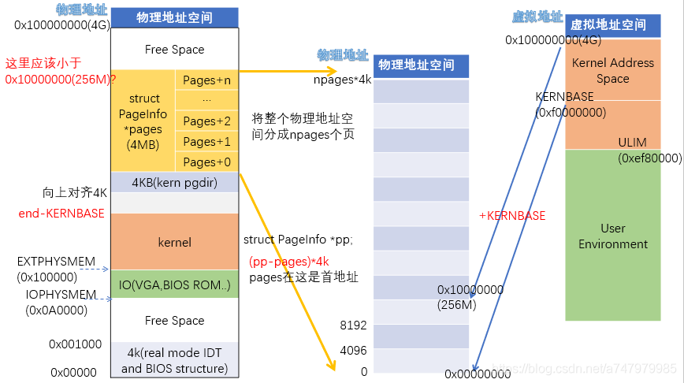

### Part2 : Virtual Memory

##### Exercise 2

* lab1中开启了分段和分页，并且初始化了内核页目录(地址存储在CR3中，见entry.S)
  
  有了下面这图
  
  ```textile
             Selector  +--------------+         +-----------+
            ---------->|              |         |           |
                       | Segmentation |         |  Paging   |
  Software             |              |-------->|           |---------->  RAM
              Offset   |  Mechanism   |         | Mechanism |
            ---------->|              |         |           |
                       +--------------+         +-----------+
              Virtual                   Linear                Physical
  ```

* 首先通过相应段寄存器获得地址基址，然后以虚拟地址作为偏移获得线性地址。线性地址再通过一定的机制，获得实际的物理地址

* 线性地址转换过程
  
  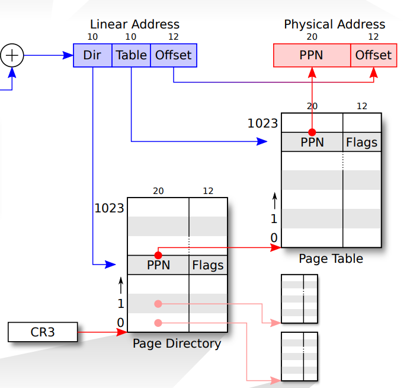

* 通过CR0寄存器打开分页机制
  
  ```textile
  // A linear address 'la' has a three-part structure as follows:
  //
  // +--------10------+-------10-------+---------12----------+
  // | Page Directory |   Page Table   | Offset within Page  |
  // |      Index     |      Index     |                     |
  // +----------------+----------------+---------------------+
  //  \--- PDX(la) --/ \--- PTX(la) --/ \---- PGOFF(la) ----/
  //  \---------- PGNUM(la) ----------/
  //
  // The PDX, PTX, PGOFF, and PGNUM macros decompose linear addresses as shown.
  // To construct a linear address la from PDX(la), PTX(la), and PGOFF(la),
  // use PGADDR(PDX(la), PTX(la), PGOFF(la)).
  ```

* 首先取线性地址的高10位作为页目录索引(Page Directory Index)，共1024个，从 0 ~ 1023。再使用cr3寄存器中的高二十位定位内存中页目录的基址。
  
  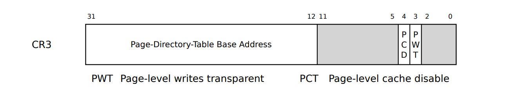
  
  PDE和PTE中，每个单元都是4byte(简单来说，这样可以使2^10个entry刚好到4kb page ，见[这里](https://cirosantilli.com/x86-paging#page-table-entries))
  
  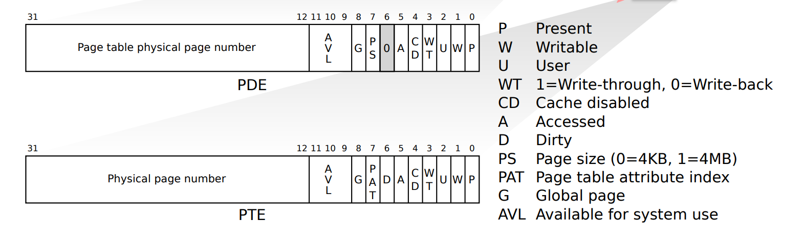

最后在页目录中的寻址组成为:


 每个索引只使用高20位进行寻址，因为页操作的最小粒度为4KB(1k的数量，每个为4k大小，两者相乘== 索引大小4byte * 2 ^ 20)。只需要4个字节的前面20位进行寻址就行了，剩下的比特可以用作其他标志位。

根据前十位索引获得相应的页目录项后，用其前20位作为一个4KB对齐的地址作为页表（Page Table）的基址。然后从线性地址中取出中间的10位作为的索引，得到相应的页表项（Page Table Entry）。

继续从PTE中取出前20位得到4KB对齐的基址，然后从利用线性地址（LA）最后12位作为在这4K页内的偏移，组合得到32位的地址，即最终的物理地址。

#### Virtual,Linear,and Physical Address

##### Exercise 3

物理地址在[0, 4MB)的，对应虚拟地址[KERNBASE, KERNBASE+4MB)

JOS中定义了两种针对于不同地址的数据类型,`uintptr_t`代表虚拟地址,`physaddr_t`表示物理地址,宏定义都为`uint32_t`。解引用(dereference)都要通过段页机制实现，所以如果对物理地址进行解引用，会有非预期的结果。

###### Question

value 是char *，值是虚拟地址，所以x也是uintptr_t

#### Page Table Management

##### Exercise 4

```c
// 返回va的PTE地址
pte_t *
pgdir_walk(pde_t *pgdir, const void *va, int create)
{
    // Fill this function in
    pde_t *pde = &pgdir[PDX(va)];
    uint32_t *pt_addr;

    if (!(*pde & PTE_P)) {
        if (!create) {
            return NULL;
        }

        struct PageInfo *pp;

        if ((pp = page_alloc(ALLOC_ZERO)) == NULL) {  // allocate and clear the page
            return NULL;
        }
        pp->pp_ref++;
        *pde = page2pa(pp) | PTE_P | PTE_W | PTE_U;
    }
    pt_addr = KADDR(PTE_ADDR(*pde));
    return (pte_t *)(pt_addr + PTX(va));
}


// 把虚拟地址 [va, va+size)映射到物理地址[pa, pa+size)，也就是说让va对应的页表项内存物理地址pa
// 不需要roundup，size本身就是对齐
static void
boot_map_region(pde_t *pgdir, uintptr_t va, size_t size, physaddr_t pa, int perm)
{
    size_t i;
    for (i = 0; i < size / PGSIZE; i++) {
        pte_t *pte;

        if ((pte = pgdir_walk(pgdir, (void *)va, 1)) == NULL) {
            panic("boot_map_region: allocation failure");
        }
        *pte = pa | perm | PTE_P;
        va += PGSIZE;
        pa += PGSIZE;
    }
}

// 查找虚拟地址va对应的页表项，返回页表项内保存的物理页在PageInfo结构体中的索引值
struct PageInfo *
page_lookup(pde_t *pgdir, void *va, pte_t **pte_store)
{
    pte_t *pte;

    if ((pte = pgdir_walk(pgdir, va, 0)) == NULL || (*pte & PTE_P) == 0) {
        return NULL;
    }
    // 一定不能忘了检查，否则在lab5会出大bug
    if (pte_store) {
        *pte_store = pte;
    }
    return pa2page(PTE_ADDR(*pte));
}

// 取消物理页对虚拟地址va的映射，也就是说删除va在页表中的对应表项
void
page_remove(pde_t *pgdir, void *va)
{
    struct PageInfo *pp;
    pte_t *pte;

    if ((pp = page_lookup(pgdir, va, &pte)) == NULL) {
        return;
    }
    page_decref(pp);
    *pte = 0;
    tlb_invalidate(pgdir, va);
}


// corner-case: re-inserted 的情况下，代码需要这样处理
    if (page2pa(pp) == PTE_ADDR(*pte)) {
        pp->pp_ref--;  // this re-implements page_remove()
        *pte = 0;
        tlb_invalidate(pgdir, va);

 // 建立PageInfo结构体pp对应物理页与虚拟地址va的映射
// 优雅的解决方式是直接之前就++
int
page_insert(pde_t *pgdir, struct PageInfo *pp, void *va, int perm)
{
    pte_t *pte;

    if ((pte = pgdir_walk(pgdir, va, 1)) == NULL) {
        return -E_NO_MEM;
    }
    pp->pp_ref++;
    if (*pte & PTE_P) {
        page_remove(pgdir, va);
    }
    *pte = page2pa(pp) | perm | PTE_P;
    return 0;
}
```

### Part 3: Kernel Address Space

JOS把线性地址分为两部分，低地址的用户环境(User enviroment - Processes)和高地址的内核，用户部分在Lab3中加载使用。内存分给内核从`KERNBASE`开始到内存结束共大约256MB。

#### Initializing the Kernel Address Space

##### Exercise 5

```c
// Map 'pages' read-only by the user at linear address UPAGES
boot_map_region(kern_pgdir, UPAGES, PTSIZE, PADDR(pages), PTE_U | PTE_P);

// Map kernel stack from [KSTACKTOP-PTSIZE, KSTACKTOP)
boot_map_region(kern_pgdir, KSTACKTOP - KSTKSIZE, KSTKSIZE, PADDR(bootstack), PTE_W | PTE_P);

// Map all of physical memory at KERNBASE.
boot_map_region(kern_pgdir, KERNBASE, 0xffffffff - KERNBASE, 0, PTE_W | PTE_P);
```

###### Question2

| Entry | Base Virtual Address | Points to (logically)                            |
| ----- | -------------------- | ------------------------------------------------ |
| 1023  | 0xffc00000           | Page table for top 4MB of physical memory        |
| 1022  | 0xff800000           | Page table for second top 4MB of physical memory |
| ...   | ...                  | ...                                              |
| 960   | 0xf0000000           | Page table for first 4MB of physical memory      |
| 959   | 0xefc00000           | First 8 PDEs are page table for `bootstack`      |
| 957   | 0xef400000           | Page directory itself                            |
| 956   | 0xef000000           | `pages` data structure                           |
| 955   | 0xeec00000           | *Unmapped*                                       |
| ...   | ...                  | *Unmapped*                                       |
| 2     | 0x00800000           | *Unmapped*                                       |
| 1     | 0x00400000           | *Unmapped*                                       |
| 0     | 0x00000000           | *Unmapped*                                       |

###### Question3

kernel 运行在 ring 0，user application 运行在 ring 3

###### Question4

###### Question5

当没有空闲的PDEs时就会发生，

- PD: 1024 entries * 4 bytes = 4 KB
- PT: 1024 PTs * 1024 entries * 4 bytes = 4 MB

共 : 4100KB

###### Question6

在 $relocated之后，在临时的内核页目录中，同时将虚拟地址 [0 ~ 4MB) 和 [KERNELBASE ~ KERNELBASE+4MB) 映射了物理内存 [0 ~
 4MB)，所以即使 PE 置位后仍然能正常执行。在 lab2 中重新加载了新映射的 kern_pgdir，里面并没有映射 [0 ~ 4MB) 
这一部分

## lab3: User Environments

### Part A: User Environments and Exception Handling

注意点:

GCC 7及之后的，启动lab3会出问题，需要在kern/kernel.ld中添加

```asm6502
--- a/kern/kernel.ld
+++ b/kern/kernel.ld
@@ -50,6 +50,7 @@ SECTIONS
        .bss : {
                PROVIDE(edata = .);
                *(.bss)
+               *(COMMON)
                PROVIDE(end = .);
                BYTE(0)
        }
```

在这个lab中，术语 environment 和 process 意思是一样的。

一旦JOS启动并运行，envs指针指向表示系统中所有environment的Env结构数组

在我们的设计中,JOS内核将支持最多NENV个环境同时属于active状态。

这种设计允许轻松地分配和释放环境，因为它们只需要添加到或从’ env_free_list '中删除即可。

内核使用curenv符号来跟踪任何给定时间的当前执行环境。在引导期间，在第一个环境运行之前，curenv最初被设置为NULL

在内核中 only one JOS environment active ，因此JOS只需要一个内核堆栈。

#### Allocating the Environments Array

##### Exercise1

```c
// Make 'envs' point to an array of size 'NENV' of 'struct Env'.
envs = (struct Env *)boot_alloc(NENV * sizeof(struct Env));
memset(envs, 0, NENV * sizeof(struct Env));
// ...
// Map the 'envs' array read-only by the user at linear address UENVS
boot_map_region(kern_pgdir, UENVS, PTSIZE, PADDR(envs), PTE_U | PTE_P);

```

#### Creating and Running Environments

##### Exercise 2

```c
// inserted to the free list from tail to head
void
env_init(void)
{
    int i;

    // Set up envs array
    for (i = NENV - 1; i >= 0; i--) {
        envs[i].env_status = ENV_FREE;
        envs[i].env_id = 0;
        envs[i].env_link = env_free_list;
        env_free_list = &envs[i];
    }

    // Per-CPU part of the initialization
    env_init_percpu();
}


static int
env_setup_vm(struct Env *e)
{
    int i;
    struct PageInfo *p = NULL;

    // Allocate a page for the page directory
    if (!(p = page_alloc(ALLOC_ZERO)))
        return -E_NO_MEM;

    // Now, set e->env_pgdir and initialize the page directory.
    p->pp_ref++;
    e->env_pgdir = (pde_t *)page2kva(p);
    // kern_pgdir can be used as a template
    // 所以可以直接copy
  	// 所有envs在UTOP之上的虚拟地址都是相同
    memcpy(e->env_pgdir, kern_pgdir, PGSIZE);

    // UVPT maps the env's own page table read-only.
    // Permissions: kernel R, user R
    e->env_pgdir[PDX(UVPT)] = PADDR(e->env_pgdir) | PTE_P | PTE_U;

    return 0;
}

// 为env分配和映射物理内存
static void
region_alloc(struct Env *e, void *va, size_t len)
{
    void *begin = ROUNDDOWN(va, PGSIZE);
    void *end = ROUNDUP(va + len, PGSIZE);

    if ((uint32_t)end > UTOP) {
        panic("region_alloc: cannot allocate pages over UTOP");
    }

    while (begin < end) {
        struct PageInfo *pp;
      	// 分配
        if ((pp = page_alloc(0)) == NULL) {
            panic("region_alloc: out of free memory");
        }
      	// 映射
        int r = page_insert(e->env_pgdir, pp, begin, PTE_U | PTE_W);

        if (r != 0) {
            panic("region_alloc: %e", r);
        }
        begin += PGSIZE;
    }
}

// 需要解析ELF文件，查看相关reference
static void
load_icode(struct Env *e, uint8_t *binary)
{
    struct Elf *elfhdr = (struct Elf *)binary;

    if (elfhdr->e_magic != ELF_MAGIC) {
        panic("load_icode: invalid elf header");
    }

    // switch to env's address space
    lcr3(PADDR(e->env_pgdir));

    // load each program segment
    struct Proghdr *ph = (struct Proghdr *)(binary + elfhdr->e_phoff);
    struct Proghdr *eph = ph + elfhdr->e_phnum;

    for (; ph < eph; ph++) {
        if (ph->p_type == ELF_PROG_LOAD) {
            if (ph->p_filesz > ph->p_memsz) {
                panic("load_icode: invalid program header (p_filesz > p_memsz)");
            }
            region_alloc(e, (uint8_t *)ph->p_va, ph->p_memsz);
            // The ph->p_filesz bytes from the ELF binary, starting at
	        // 'binary + ph->p_offset', should be copied to virtual address
	        // ph->p_va.
            memcpy((uint8_t *)ph->p_va, binary + ph->p_offset, ph->p_filesz);
            // marked in the program header as being mapped but not actually present
            memset((uint8_t *)ph->p_va + ph->p_filesz, 0, ph->p_memsz - ph->p_filesz);
        }
    }

    // make eip points to the entry point
    e->env_tf.tf_eip = elfhdr->e_entry;

    // Now map one page for the program's initial stack
    // at virtual address USTACKTOP - PGSIZE.
    region_alloc(e, (void *)(USTACKTOP - PGSIZE), PGSIZE);

    // switch back to kernel address space
    lcr3(PADDR(kern_pgdir));
}

// 使用env_alloc 分配env，并调用load_icode将ELF二进制文件加载
void
env_create(uint8_t *binary, enum EnvType type)
{
    struct Env* env;
    int r;

    if ((r = env_alloc(&env, 0)) != 0) {
        panic("env_create: %e", r);
    }
    load_icode(env, binary);
    env->env_type = type;
}

// 用户模式喜爱运行env
void
env_run(struct Env *e)
{
    if (curenv != NULL && curenv->env_status == ENV_RUNNING) {
        curenv->env_status = ENV_RUNNABLE;
    }
    curenv = e;
    e->env_status = ENV_RUNNING;
    e->env_runs++;
    lcr3(PADDR(e->env_pgdir));
    env_pop_tf(&e->env_tf);
}

```

#### Handling Interrupts and Exceptions

##### Exercise 3

中断是外部发给CPU的信号，而异常是CPU在自己处理命令时候出现的错误。
其中中断分为可屏蔽和不可屏蔽的。

异常也有三种(Faults/Traps/Aborts)，Faults异常是在执行这条指令之前就被指出的错误，但是如果在执行的过程中遇到了faults级的错误，CPU将会让机器保存状态，并且允许被修正重新执行。

第二种是Traps异常，是一种执行完后立即报告的异常，允许程序连续性执行，异常处理的返回地址就是trap指令后的那条。

第三种是Aborts异常，这种异常不报告异常发生的精确位置，也不运行程序继续往下执行。往往是发生了严重的错误，例如硬件错误和不合法的数值

进程确保在严格控制的条件下才能进入内核

* The Interrupt Descriptor Table.内核的entry-points都是内核自己定义的。x86有256个中断或异常的入口点，对应着不同的中断向量(0-255)， The CPU uses the vector as an index into the processor’s interrupt descriptor table (IDT)。从IDT的对应条目中加载EIP和CS register值。

* `The Task State Segment` 处理器需要一个地方保存旧处理器中断或异常发生前的状态,如EIP的原始值和CS在处理器调用异常处理程序之前,所以异常处理程序结束后处理器可以恢复之前状态和恢复中断的代码。

  因此，当x86处理器发生中断或陷阱，导致特权级别从用户更改为内核模式时，它还会切换到内核内存中的堆栈。 一个名为任务状态段(task state segment, TSS)的结构指定了这个堆栈所在的段选择器和地址。处理器(在这个新堆栈上)推送SS、ESP、EFLAGS、CS、EIP和an optional error code。然后它从中断描述符加载CS和EIP，并设置ESP和SS引用新的堆栈。
  JOS只使用TSS来定义处理器应该切换到的kernel stack。主要是 ESP0 and SS0 fields of the TSS


`IF`(interrput-enable flag)是控制屏蔽外中断的标志位。当IF=0，中断会被屏蔽，IF=1，中断才会被接收。
CLI (Clear Interrupt-Enable Flag) and STI (Set Interrupt-Enable Flag) explicitly alter IF (bit 9 in the flag register).

`IF`标志位被以下三种情况隐性影响：

- `PUSHF`存储所有flag，包括IF。在栈中的IF，可以被修改。
- 任务切换时，`POP`和`IRET`读取flag寄存器，因此，这步操作能修改IF
- 中断通过interrupt gates(?)能自动重置IF，也就关闭外中断。

设置段地址的时候也会发生中断，影响程式的执行。通常设置栈区的段的时候通常使用以下这一对指令。

```c
    MOV SS, AX
    MOV ESP, StackTop
```

如果这时候发生中断或者异常，SS已经被设置成了AX，而ESP的值还没被传达到，栈指针，SS:ESP在处理中断和异常的时候是不正常的，所以80386CPU在处理这两条指令的时候会屏蔽NMI,INTR, debug exceptions, and single-step traps这些中断。

#### Setting Up the IDT


##### Exercise 4

```c
// kern/trapentry.S
// 查手册明确哪些需要error code
TRAPHANDLER_NOEC(th_divide, T_DIVIDE)
TRAPHANDLER_NOEC(th_debug, T_DEBUG)
TRAPHANDLER_NOEC(th_nmi, T_NMI)
TRAPHANDLER_NOEC(th_brkpt, T_BRKPT)
TRAPHANDLER_NOEC(th_oflow, T_OFLOW)
TRAPHANDLER_NOEC(th_bound, T_BOUND)
TRAPHANDLER_NOEC(th_illop, T_ILLOP)
TRAPHANDLER_NOEC(th_device, T_DEVICE)
TRAPHANDLER(th_dblflt, T_DBLFLT)
TRAPHANDLER(th_tss, T_TSS)
TRAPHANDLER(th_segnp, T_SEGNP)
TRAPHANDLER(th_stack, T_STACK)
TRAPHANDLER(th_gpflt, T_GPFLT)
TRAPHANDLER(th_pgflt, T_PGFLT)
TRAPHANDLER_NOEC(th_fperr, T_FPERR)
TRAPHANDLER(th_align, T_ALIGN)
TRAPHANDLER_NOEC(th_mchk, T_MCHK)
TRAPHANDLER_NOEC(th_simderr, T_SIMDERR)


// make the stack look like a struct Trapframe
// 现在在内核栈，tf_ss与tf_esp不需要入栈，中间eflags、cs、eip由硬件完成，所以只要入栈ds与es还有regs
// pusha指令的描述:当操作数的大小是32位时：这两个指令的作用是把通用寄存器压栈。寄存器的入栈顺序依次是：EAX,ECX,EDX,EBX,ESP(初始值)，EBP,ESI,EDI.
//所以这里的pushal就是对应着struct PushRegs tf_regs
// 所以需要push struct中的es、ds，但是stack时high -> low，struct 是从low -> high
// 顺序要相反,且不能直接给ds、es赋值，需要先mov一个通用的寄存器ax
// GD_KD见memlayout.h
_alltraps:
    pushl %ds
    pushl %es
    pushal
    movw $GD_KD, %ax
    movw %ax, %ds
    movw %ax, %es
    pushl %esp
    call trap

// trap.c

void
trap_init(void)
{
    extern struct Segdesc gdt[];

    void th_divide();
    void th_debug();
    void th_nmi();
    void th_brkpt();
    void th_oflow();
    void th_bound();
    void th_illop();
    void th_device();
    void th_dblflt();
    void th_tss();
    void th_segnp();
    void th_stack();
    void th_gpflt();
    void th_pgflt();
    void th_fperr();
    void th_align();
    void th_mchk();
    void th_simderr();

    SETGATE(idt[T_DIVIDE], 1, GD_KT, &th_divide, 0);
    SETGATE(idt[T_DEBUG], 1, GD_KT, &th_debug, 0);
    SETGATE(idt[T_NMI], 0, GD_KT, &th_nmi, 0);
    SETGATE(idt[T_BRKPT], 1, GD_KT, &th_brkpt, 3);
    SETGATE(idt[T_OFLOW], 1, GD_KT, &th_oflow, 0);
    SETGATE(idt[T_BOUND], 1, GD_KT, &th_bound, 0);
    SETGATE(idt[T_ILLOP], 1, GD_KT, &th_illop, 0);
    SETGATE(idt[T_DEVICE], 1, GD_KT, &th_device, 0);
    SETGATE(idt[T_DBLFLT], 1, GD_KT, &th_dblflt, 0);
    SETGATE(idt[T_TSS], 1, GD_KT, &th_tss, 0);
    SETGATE(idt[T_SEGNP], 1, GD_KT, &th_segnp, 0);
    SETGATE(idt[T_STACK], 1, GD_KT, &th_stack, 0);
    SETGATE(idt[T_GPFLT], 1, GD_KT, &th_gpflt, 0);
    SETGATE(idt[T_PGFLT], 1, GD_KT, &th_pgflt, 0);
    SETGATE(idt[T_FPERR], 1, GD_KT, &th_fperr, 0);
    SETGATE(idt[T_ALIGN], 0, GD_KT, &th_align, 0);
    SETGATE(idt[T_MCHK], 0, GD_KT, &th_mchk, 0);
    SETGATE(idt[T_SIMDERR], 0, GD_KT, &th_simderr, 0);
    SETGATE(idt[T_SYSCALL], 0, GD_KT, &th_syscall, 3);

    // Per-CPU setup 
    trap_init_percpu();
}

```

trapentry.S中的两个宏，主要是err和trapno入栈，完善Trapframe结构的一部分，处理程序的入口地址

_alltraps的作用

```textile
					 					 +--------------------+  //stack向下增长，留心“-”号          
                     | 0x00000 | old SS   |     " - 4 <---- ESP 
                     |      old ESP       |     " - 8
                     |     old EFLAGS     |     " - 12
                     | 0x00000 | old CS   |     " - 16
                     |      old EIP       |     " - 20 
  iret将上面出栈----> +--------------------+			 <---- 以上在陷入发生时由硬件完成
                     |        err     	  |     " - 24
                     |      trapno        |     " - 28
                     +--------------------+ 		<----以上由TRAPHANDLER宏完成
                     |        ds          |     " - 32 
                     |        es          |     " - 36 
(trapframe)old esp-> |       regs         |     " - 不知道多少
                		 |     old esp        |
    			     			 +--------------------+    		<----以上由_alltraps完成  
    			     			 |     ret addr       |      
    	new ebp----> 	 |     old ebp        |  <----esp 
    			     			 +--------------------+    		<----以上是call调用完成 

```


从下往上看跟trapframe一摸一样


具体流程

```c
env_init()所有env加入env_free_list，env[0]在表头、per-cpu(Load GDT and 段选择器(segment descriptors))
-->trap_init()让IDT(Interrupt descriptor table)条目指向对应处理函数入口地址、trap_init_percpu
-->env_create(binary_obj_user_hello_start, type)这里面又包括两个函数
	-->env_alloc(&e,0);通过env_setup_vm初始化虚拟内存(页表)、初始化env各信息包括'e->env_tf'、从env_free_list中取出env[0]
	-->load_icode(e,binary)从binary中加载程序段到e对应的内存空间
-->env_run(&env[0]);curenv=env[0]，改好状态
	-->env_pop_tf(&curenv->env_tf)把&env_tf为起始地址的一段空间'当成栈'，逐步popa、pop、iret到相应寄存器。且iret结束后进入'user mode'
-->寄存器都赋值了，开始执行eip=env_tf.tf_eip=0x800020 即lib/entry.S/_start,然后call libmain

-->lib/libmain.c/libmain()先通过系统调用赋值thisenv,然后调用umain(),最后exit()

	-->	thisenv = &envs[ENVX(sys_getenvid())];
		//下面开始sys_getenvid系统调用的过程
		-->lib/sys_getenvid()赋值thisenv
				lib/sys_getenvid()包含了syscall(SYS_getenvid, 0, 0, 0, 0, 0, 0);
		-->syscall(...)包含int %T_SYSCALL,中断向量48号，从IDT[48]中找到对应的处理函数入口地址syscall_handler()，陷入'内核态'
						此外，还会传入system call num(%eax中)，EDX, ECX, EBX, EDI, ESI的值作为参数
		-->kern/trapentry.S/TRAPHANDLER_NOEC(syscall_handler, T_SYSCALL);
				_alltraps 完善栈，让栈看上去像Trapframe结构
					call trap
		-->trap(tf) 重设方向标志位DF、从栈里copy trap frame到curenv->env_tf，然后tf(很重要)再指向它方便返回curenv继续执行
				-->trap_dispatch(tf);
					tf->tf_trapno == T_SYSCALL所以调用kern/syscall()  //注意跟lib/syscall()区分。这里是内核态
						-->kern/syscall()
								syscallno==SYS_getenvid所以这里发生在kern/syscall/sys_getenvid()   //
						-->sys_getenvid()返回curenv->env_id到'tf->tf_regs.reg_eax'中
				-->env_run(curenv) 设置curenv的状态，调用env_pop_tf
					-->env_pop_tf(&curenv->env_tf);将tf里的数据读到对应'寄存器'中，然后进入'user mode'
						-->'iret'指令后进入user mode，也就是说回到umain()的thisenv处继续往下执行
	
	-->umain()
		//下面开始cprintf("hello, world\n");里的sys_cputs()系统调用过程		
		-->user/hello.c/umain()，里面有lib/cprintf()函数，cprintf函数最内部'系统调用sys_cputs()'组成
				cprintf()调用vcprintf()调用vprintmt()调用putch()调用cputchar()调用lib/syscall/sys_cputs()调用syscall()
				//这里一定要注意区分lib/syscall.c跟kern/syscall.c，只有前者才包含系统调用，从用户态陷入内核态
		-->lib/sys_cputs()包含了syscall(SYS_cputs, 0, (uint32_t)s, len, 0, 0, 0);同样通过'int %T_SYSCALL'进入kern/trapentry.S，即陷入'内核态'
		-->kern/trapentry.S/TRAPHANDLER_NOEC(syscall_handler, T_SYSCALL);
				_alltraps 完善栈，让栈看上去像Trapframe结构
					call trap
		-->trap(tf) 重设方向标志位DF、从栈里copy trap frame到curenv->env_tf，然后tf(很重要)再指向它方便返回curenv继续执行
				-->trap_dispatch(tf);
					tf->tf_trapno == T_SYSCALL所以调用kern/syscall()  //注意跟lib/syscall()区分。这里是内核态下了
						-->kern/syscall()
								syscallno==SYS_cputs所以调用kern/sys_cputs()	   //当前在内核态，注意区分哟
						-->sys_cputs()检查内存空间[s,s+len)的权限后调用kern/cprintf()将内容打印到'console'
				-->env_run(curenv) 设置curenv的状态，调用env_pop_tf
					-->env_pop_tf(&curenv->env_tf);将tf里的数据读到对应'寄存器'中，然后进入'user mode'
						-->'iret'指令后进入user mode，也就是说回到umain()的cprintf("hello world")处继续往下执行
		-->下面还有一个cprintf("i am environment %08x\n", thisenv->env_id);把上面sys_cputs()系统调用过程再来一遍

	-->exit(){sys_env_destroy(0);}//参数是envid=0
		//下面是lib/sys_env_destroy()系统调用过程
		lib/exit.c/sys_env_destroy()包含lib/syscall(SYS_env_destroy, 1, envid, 0, 0, 0, 0);
		-->'int %T_SYSCALL'--> TRAPHANDLER_NOEC(syscall_handler, T_SYSCALL)
		-->trap(tf)
			-->trap_dispatch(tf);
				tf->tf_trapno == T_SYSCALL所以调用kern/syscall()
				-->kern/syscall()
					syscallno==SYS_env_destroy所以调用kern/sys_env_destroy()  //内核态下
				-->sys_env_destroy()
					-->envid2env(envid, &e, 1);根据envid从env_store中找到对应env的地址，并检查是否有效
						//0 on success, -E_BAD_ENV on error.
						//On success, sets *env_store to the environment.（即&e）
						//On error, sets *env_store to NULL.
					-->env_destroy(e);
						-->env_free(e);
						-->monitor(NULL)
						
-->while(1) monitor(NULL);	

```


env_pop_tf过程

```c
//注释出自这里：http://www.mamicode.com/info-detail-2493874.html
void env_pop_tf(struct Trapframe *tf)
{
	asm volatile(
		"\tmovl %0,%%esp\n"  /*将%esp指向tf地址处*/
		"\tpopal\n"			//弹出Trapframe结构中的tf_regs值到通用寄存器
		"\tpopl %%es\n"		//弹出Trapframe结构中的tf_es值到%es寄存器
		"\tpopl %%ds\n"		 //弹出Trapframe结构中的tf_ds值到%ds寄存器
		"\taddl $0x8,%%esp\n" /* skip tf_trapno and tf_errcode */
		"\tiret\n"  /*  //中断返回指令，具体动作如下：从Trapframe结构中依次弹出tf_eip,tf_cs,tf_eflags,tf_esp,tf_ss到相应寄存器*/
		: : "g" (tf) : "memory"); //g是一个通用约束，可以表示使用通用寄存器、内存、立即数等任何一种处理方式
	panic("iret failed");  /* mostly to placate the compiler */
}

```


1. `envs`结构体数组保存着`所有`用户环境的状态信息

2. `env的分配`就是把env_free_list的`表头`取出，然后初始化内存空间与状态信息，所有environment地址空间的内核部分都是一样的，至于内存空间的用户部分的加载就得从二进制映像文件(ELF格式)读取。不过不要忘记修改`env_status`

3. `env的free`也很简单，就是把内存空间释放掉，然后env重新插回env_free_list的`表头`

4. 中断分为可屏蔽中断(`INTR引脚`发出信号)与不可屏蔽中断(`NMI引脚`发出信号)。异常可以是处理器发现(可细分为`faults、traps and aborts`),也可以是可编程的(软件中断)。不可屏蔽中断与异常应该就是对应`中断向量0-31`号。`系统调用`对应0x30(48)号

5. 当特权级从用户模式向内核模式转换时，内核不能使用用户的栈，因为它可能不是有效的。用户进程可能是恶意的或者包含了一些错误，使得用户的 %esp 指向一个不是用户内存的地方。在内陷发生的时候进行一个栈切换，栈切换的方法是让硬件从一个任务段描述符中读出新的栈选择符和一个新的 %esp 的值。通过相关函数把用户进程的内核栈顶地址存入任务段描述符(**Task State Segment**)

6. 在JOS中，各个环境不像xv6中的进程那样拥有自己的内核堆栈。**一次只能有一个JOS环境活动在内核中**，因此JOS只需要`一个内核堆栈`

7. 引发中断或者异常的进程都会有一个`Trapframe`，保存着中断或异常发生前的`处理器状态`以便处理完后恢复继续执行。这个很重要，一定要明白`tf`保存的是当前执行进程引发中断或者异常时的处理器状态信息(包括寄存器值以及中断向量号)。

8. 从内核态进入用户态主要是env_pop_tf()里的`iret指令`之后。发生中断、异常、系统调用时会从用户态陷入内核态，主要是通过`int指令`

9. 中断也可能`发生在内核模式`下。在那种情况下硬件不需要进行栈转换，也不需要保存栈指针或栈的段选择符；除此之外的别的步骤都和发生在用户模式下的中断一样。而 iret 会恢复了一个内核模式下的 %cs，处理器也会继续在内核模式下执行

10. 每一个中断/异常都对应一个`中断向量`，在IDT中又作为index对应一个`中断向量描述符`，每个中断向量描述符又对应一个`中断处理程序`的入口地址
    
    

###### Question

1. 为了push对应的error code到具体的栈，为了权限控制或者隔离

2. trap 13是general protection fault，由于softint是用户程序('asm volatile ("int $14")')，特权级别为3，页面错误的处理程序的DPL为0，特权级别为3的程序调用特权级别为0的程序就会产生一个general protection fault。如果允许的话，用户程序可以操作虚拟内存，问题就很重要

### Part B: Page Faults, Breakpoints Exceptions, and System Calls

#### Handling Page Faults


##### Exercise 5

``` c
	if (tf -> tf_trapno == T_PGFLT)
	{
		page_fault_handler(tf);
		return;
	}
```

#### The Breakpoint Exceptions


##### Exercise 6

``` c
    if (tf->tf_trapno == T_BRKPT) {
        monitor(tf);
        return ;
    }
```

###### Question

3. SETGATE(idt[T_BRKPT], 1, GD_KT, brkpt_handler, 3);中如果最后一个参数dpl设为3就会产生一个breakpoint exception，如果设为0就会产生一个general protection fault。这也是由于特权级别影响的。breakpoint test程序的特权级别是3，如果断点异常处理程序特权设为3那就可以是断点异常，如果设为0就产生保护错误。

4. 里面是这条代码`asm volatile("int $14");`本来想中断调用页面错误处理，结果因为特权级别不够而产生一个保护异常

#### System calls

##### Exercise 7

读懂sys_call的汇编代码

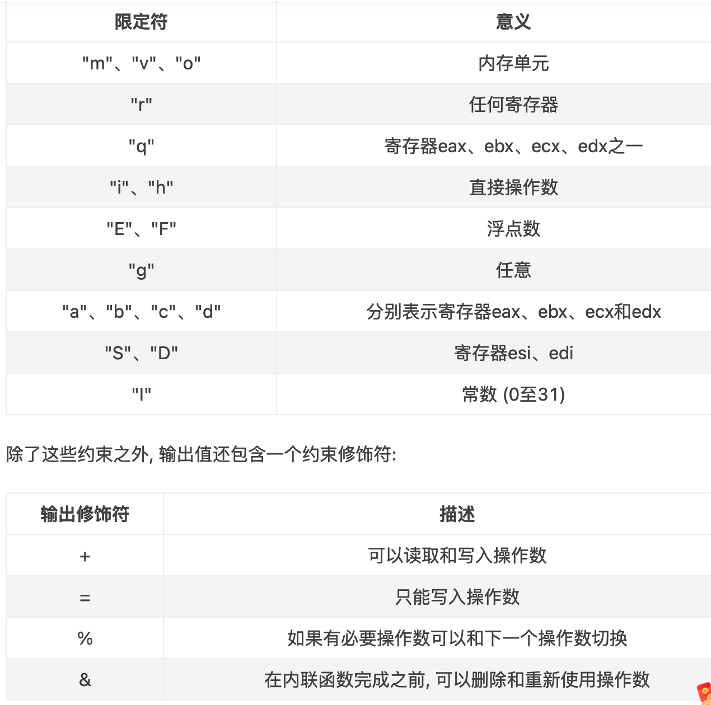

 

```c
// trapentry.S
TRAPHANDLER_NOEC(th_syscall, T_SYSCALL)

// trap.c:trap_init()
void th_syscall();

SETGATE(idt[T_SYSCALL], 0, GD_KT, &th_syscall, 3);


	if (tf -> tf_trapno == T_SYSCALL)
	{
		// arranging for the return value to be passed back to the 
		// user process in %eax
		// Generic system call: pass system call number in AX,
	   // up to five parameters in DX, CX, BX, DI, SI.
		tf->tf_regs.reg_eax = syscall(tf->tf_regs.reg_eax, 
			tf->tf_regs.reg_edx, tf->tf_regs.reg_ecx, 
			tf->tf_regs.reg_ebx, tf->tf_regs.reg_edi, 
			tf->tf_regs.reg_esi);
		return;
	}
// kern/syscall.c
int32_t
syscall(uint32_t syscallno, uint32_t a1, uint32_t a2, uint32_t a3, uint32_t a4, uint32_t a5)
{
    // Call the function corresponding to the 'syscallno' parameter.
    // Return any appropriate return value.
    switch (syscallno) {
    case SYS_cputs:
        sys_cputs((const char *)a1, a2);
        return 0;
    case SYS_cgetc:
        return sys_cgetc();
    case SYS_getenvid:
        return sys_getenvid();
    case SYS_env_destroy:
        return sys_env_destroy(a1);
    default:
        return -E_INVAL;
    }
}

```

#### User-mode startup


##### Exercise 8

```c
// lib/libmain.c
thisenv = &envs[ENVX(sys_getenvid())];
```

#### Page faults and memory protection


##### Exercise 9

```c
	// Handle kernel-mode page faults.

	// LAB 3: Your code here.
	
	//  If the processor is already in kernel mode when the interrupt or exception occurs 
	// (the low 2 bits of the CS register are already zero)
	if ((tf->tf_cs & 0x3) == 0)
	{
		panic("page_fault_handler: page fault in kernel mode");
	}
	
//kern/pmap.c:user_mem_check()
int
user_mem_check(struct Env *env, const void *va, size_t len, int perm)
{
    // LAB 3: Your code here.
    uint32_t addr = (uint32_t)va;
    uint32_t begin = ROUNDDOWN(addr, PGSIZE);
    uint32_t end = ROUNDUP(addr + len, PGSIZE);

    while (begin < end) {
        pte_t *pte = pgdir_walk(env->env_pgdir, (void *)begin, 0);

        if (begin >= ULIM || pte == NULL || !(*pte & PTE_P) || (*pte & perm) != perm) {
            user_mem_check_addr = (begin < addr) ? addr : begin;
            return -E_FAULT;
        }
        begin += PGSIZE;
    }
    return 0;
}
// kern/syscall.c:sys_cputs
user_mem_assert(curenv, s, len, PTE_U);


// kern/debug.c
const struct UserStabData *usd = (const struct UserStabData *) USTABDATA;

// Make sure this memory is valid.
// Return -1 if it is not.  Hint: Call user_mem_check.
if (user_mem_check(curenv, usd, sizeof(struct UserStabData), PTE_U) < 0) {
    return -1;
}

stabs = usd->stabs;
stab_end = usd->stab_end;
stabstr = usd->stabstr;
stabstr_end = usd->stabstr_end;

// Make sure the STABS and string table memory is valid.
if (user_mem_check(curenv, stabs, stab_end - stabs, PTE_U) < 0) {
    return -1;
}
if (user_mem_check(curenv, stabstr, stabstr_end - stabstr, PTE_U) < 0) {
    return -1;
}

```

1. 当处理器收到一个`page fault`，它将导致错误的`linear(或virtual) address`存在一个特别的处理器控制寄存器`CR2`中在用户态发生页面错误可以陷入内核态去处理，处理完后会直接`结束掉报错进程`，但是`内核态`却`不能`发生页面错误，否则会导致内核重启
2. User processes(用户进程)通过调用system calls要求内核为它们做事。当用户进程调用一个系统调用，处理器会进入kernel mode，处理器和内核合作去报错用户进程的状态。JOS中T_SYSCALL是48(0x30)。Application(应用程序)会在寄存器中传递系统调用号和系统调用参数
3. A user program开始运行在lib/entry.S的顶部
4. Memory protection是操作系统一个至关重要的特性，确保一个程序的bugs不会破坏其他程序或者破坏操作系统自身。操作系统经常依赖于hardware support(硬件支持)去实现内存保护。当一个程序试着去access(访问)一个无效地址或者一个它没有权限访问的地址的时候，处理器会停止这个程序在这条导致fault的指令上，然后带着这尝试操作的信息陷入内核
5. 当一个程序向内核传一个指针的时候，内核会检查这个`地址是否在`地址空间的`用户部分`，并且`页表是否允许`这个内存操作
6. 特权级别是个很重要的点。每个IDT的entries内的中断描述符都为中断处理程序设定了一个DPL(Descriptor Privilege Level)。用户程序的特权级别是3，内核的特权级别是0(可知0级别更高)。如果用户产生的中断/异常需要级别0，那么用户就无权请内核调用这个处理程序，就会产生一个general protection fault，如果是内核发生中断/异常的话，特权级别总是够的

## lab4: Preemptive Multitasking

### Part A: Multiprocessor Support and Cooperative Multitasking

#### Multiprocessor Support 


##### Exercise 1

```c
// lapic_init()首先调用mmio_map_region()分配4k
void *
mmio_map_region(physaddr_t pa, size_t size)
{
    size_t rounded_size = ROUNDUP(size, PGSIZE);

    if (base + rounded_size >= MMIOLIM) {
        panic("mmio_map_region: requested size overflow MMIOLIM");
    }
    boot_map_region(kern_pgdir, base, rounded_size, pa, PTE_PCD | PTE_PWT | PTE_W);
    // base 是静态变量，一直在增长，而我们需要返回的是起始位置
    uintptr_t curr_base = base;
    base += rounded_size;
    return (void *)curr_base;
}

```

#### Application Processor Bootstrap


##### Exercise 2

boot_aps():将MPENTRY的代码安装到内核中去，为每一个cpu准备相应的栈区。然后通过一个for循环初始化所以cpu，在循环体内用while循环等待cpu被启动好的信号。lapic_startup(id, addr)然后发送IPI以及一个初始的CS:IP到APIC bus上，让相应AP的LAPIC收到这个中断，开始执行mpentry.S中的内容，开启保护模式，分页；加载数据段，代码段等。（注：上述流程能成立，Multi-Processor Specification的规定，见mpentry.S的注释）

> STARTUP IPIs are used with systems based on Intel processors with local APIC versions of 1.x or higher. These local APICs recognize the STARTUP IPI, which is an APIC Interprocessor Interrupt with trigger mode set to edge and delivery mode set to “110” (bits 8 through 10 of the ICR).
>
> The STARTUP IPI causes the target processor to start executing in Real Mode from address 000VV000h, where VV is an 8-bit vector that is part of the IPI message. Startup vectors are limited to a 4-kilobyte page boundary in the first megabyte of the address space. Vectors A0-BF are reserved; do not use vectors in this range. STARTUP IPIs are not maskable, do not cause any change of state in the target processor (except for the change to the instruction pointer), and can be issued only one time after RESET or after an INIT IPI reception or pin assertion. A STARTUP IPI neither requires the targeted APIC to be enabled nor the interrupt table to be programmed. If the target processor is in the halted state immediately after RESET or INIT, a STARTUP IPI causes it to leave that state and start executing. The effect is to set CS:IP to VV00:0000h.
>
> For an operating system to use a STARTUP IPI to wake up an AP, the address of the AP initialization routine (or of a branch to that routine) must be in the form of 000VV000h. Sending a STARTUP IPI with VV as its vector causes the AP to jump immediately to and begin executing the operating system’s AP initialization routine.
>
> The operating system should not issue a STARTUP IPI to an 82489DX since the STARTUP IPI will be ignored instead of forcing the targeted processor to execute from the given address.

当mpentry执行到最后，调用mp_main()函数，初始化该AP的寄存器。lapic_init():从处理器中获取lapic的相关信息。env_init_percpu():初始化每个处理器的段寄存器。trap_init_percpu():读取TSS和IDT
在最后，xchg()即发送`CPU_STARTED`信号给boot_aps()，完成一个cpu寄存器的初始化。

```c
	for(i = 1; i < npages_basemem; i++)
	{
		if (i == MPENTRY_PADDR / PGSIZE) {
			pages[i].pp_ref = 1;
		} else {
			pages[i].pp_ref = 0;
			pages[i].pp_link = page_free_list;
			page_free_list = &pages[i];
		}
	}
```

###### Question 1


`MPBOOTPHYS`是用来计算传递进去参数的绝对地址，这段代码在boot_aps内就被复制到了内存高地址(MPENTRY_PADDR)，AP读取gdt的命令`ldgdt`是在开启保护模式之前，所以，需要使用物理地址来读取全局表，否则不能读取到。但是在boot.S中，代码就是工作在实模式下，可以直接读取。

#### Per-CPU State and Initialization


##### Exercise 3

* Per-CPU kernel stack
  因为多个CPUs可以同时陷入到内核，每个处理器需要一个单独的内核堆栈，以防止它们相互干扰执行。数组percpu_kstack [NCPU][KSTKSIZE]为NCPU的内核堆栈保留空间。
  在Lab2中，您映射了bootstack称为BSP内核堆栈的物理内存，该内核堆栈位于KSTACKTOP之下。相似的，在这个lab中，你会映射每个CPU的内核栈到这个区域，并使用保护页面(guard pages)作为它们之间的缓冲区(buffer)。CPU 0的堆栈仍然会从KSTACKTOP向下增长;CPU 1的堆栈将在CPU 0的堆栈底部以下启动KSTKGAP字节，以此类推。inc/memlayout.h显示了映射布局。

* Per-CPU TSS and TSS descriptor
  还需要per-CPU的任务状态段(task state segment, TSS)，以便指定每个CPU的内核栈位于何处。CPU i的TSS存在cpus[i].cpu_ts中，相应的TSS描述符定义在GDT条目的gdt[(GD_TSS0 >> 3) + i]中。定义在kern/trap.c中的全局ts变量将不再有用

* Per-CPU current environment pointer
  因为每个CPU可以同时运行不同用户程序，我们可以重新定义符号curenv成 cpus[cpunum()].cpu_env (or thiscpu->cpu_env)，它将指向当前CPU上正在执行的environment。

* Per-CPU system registers
  所有寄存器，包括系统寄存器，都是CPU私有的。因此，初始化这些寄存器的指令，例如lcr3(), ltr(), lgdt(), lidt(), etc.,都必须在每个CPU上执行一次。函数env_init_percpu()和trap_init_percpu()就是为这个定义的。

```c
static void
mem_init_mp(void)
{
    int i;

    for (i = 0; i < NCPU; i++) {
        uint32_t kstacktop_i = KSTACKTOP - i * (KSTKSIZE + KSTKGAP);

        boot_map_region(kern_pgdir, kstacktop_i - KSTKSIZE, KSTKSIZE, PADDR(percpu_kstacks[i]), PTE_W);
    }
}

```


##### Exercise 4

```c
void
trap_init_percpu(void)
{
    int id = thiscpu->cpu_id;

    // Setup a TSS so that we get the right stack
    // when we trap to the kernel.
    thiscpu->cpu_ts.ts_esp0 = (uint32_t)percpu_kstacks[id] + KSTKSIZE;
    thiscpu->cpu_ts.ts_ss0 = GD_KD;
    thiscpu->cpu_ts.ts_iomb = sizeof(struct Taskstate);

    // Initialize the TSS slot of the gdt.
    gdt[(GD_TSS0 >> 3) + id] = SEG16(STS_T32A, (uint32_t) (&thiscpu->cpu_ts),
                    sizeof(struct Taskstate) - 1, 0);
    gdt[(GD_TSS0 >> 3) + id].sd_s = 0;

    // Load the TSS selector (like other segment selectors, the
    // bottom three bits are special; we leave them 0)
    // 位移运算3位是因为每个描述符的大小是8字节(struct Segdesc)
    ltr(GD_TSS0 + (id << 3));

    // Load the IDT
    lidt(&idt_pd);
}

```

#### Locking


##### Exercise 5

```c
// kern/init.c:i386_init()
@@ -44,2 +44,2 @@ i386_init(void)
        // Acquire the big kernel lock before waking up APs
-       // Your code here:
+       lock_kernel();

// kern/init.c:i386_init()
@@ -107,5 +107,5 @@ mp_main(void)
        // Now that we have finished some basic setup, call sched_yield()
        // to start running processes on this CPU.  But make sure that
        // only one CPU can enter the scheduler at a time!
-       //
-       // Your code here:
+       lock_kernel();
+       sched_yield();


// kern/trap.c:trap()
@@ -276,5 +275,5 @@ trap(struct Trapframe *tf)
                // Trapped from user mode.
                // Acquire the big kernel lock before doing any
                // serious kernel work.
-               // LAB 4: Your code here.
+               lock_kernel();
                assert(curenv);

// kern/env.c:env_run()
@@ -547,5 +547,6 @@ env_run(struct Env *e)
        curenv = e;
        e->env_status = ENV_RUNNING;
        e->env_runs++;
+       unlock_kernel();
        lcr3(PADDR(e->env_pgdir));
        env_pop_tf(&e->env_tf);

```

###### Question 2

当一个CPU陷入内核还在进行保存状态信息的时候，另一个CPU刚好发生中断，此时内核还未被上锁，在只有一个栈的情况下，会发生混乱。

###### Round-Robin Scheduling


##### Exercise 6

```c
void
sched_yield(void)
{
    struct Env *idle = curenv;
    int idle_envid = (idle == NULL) ? -1 : ENVX(idle->env_id);
    int i;

    // search envs after idle
    for (i = idle_envid + 1; i < NENV; i++) {
        if (envs[i].env_status == ENV_RUNNABLE) {
            env_run(&envs[i]);
        }
    }

    // find from 1st env if not found
    for (i = 0; i < idle_envid; i++) {;
        if (envs[i].env_status == ENV_RUNNABLE) {
            env_run(&envs[i]);
        }
    }

    // if still not found, try idle
    if(idle != NULL && idle->env_status == ENV_RUNNING) {
        env_run(idle);
    }

    // sched_halt never returns
    sched_halt();
}

```

###### Question 3

在env_setup_vm()的时候，已经从kern_pgdir处复制一份，UTOP以上的地址空间内容都是相同的，所以lcr3指令执行前后都是一样的

###### Question 4

context switch 需要保证环境可以恢复到之前，因此所有的registers都需要保存。当调用sys_yield()，之后就触发trap，保存到env_tf。当env_run()时，由env_pop_tf()恢复

#### System Calls for Environment Creation


##### Exercise 7

* sys_exofork:
  这个系统调用创建一个几乎是空白的新环境：没有任何东西映射在它的地址空间的用户部分，它也是不可运行的。在调用sys_exofork时，新环境与父环境具有相同的寄存器状态。在父环境中，sys_exofork会返回新创建环境的envid_t(如果环境分配失败，则返回一个负的错误代码)。在子环境中，它会返回0。(因为子环境开始被标记为不可运行，所以sys_exofork实际上不会在子环境中返回，直到在父环境通过标记子环境可运行来明确允许)
* sys_env_set_status:
  设置指定环境的status为 ENV_RUNNABLE 或 ENV_NOT_RUNNABLE。这个系统调用通常用于标记一个地址空间和寄存器状态已经被完全初始化后的新环境准备好去运行。
* sys_page_alloc:
  分配一个物理页并且映射到一个给定环境地址空间的给定虚拟地址上。
* sys_page_map:
  将一个物理页的映射(并不是物理页的内容)从一个环境的地址空间中复制到另一个环境，保留一个内存共享安排以至于新老映射都引用物理内存的同一页。
* sys_page_unmap:
  取消映射到一个给定环境的给定虚拟地址上的物理页

```c

// parent call sys_exofork，kernel 做了当前Env的拷贝，赋值到child，并标识为ENV_NOT_RUNNABLE
// 然后赋值child's envid 到 eax reigster上。然后父进程拷贝内存到子进程上，子进程设置为
// RUNNABLE。进程调度会run child env，child从eax获取自己的进程id
static envid_t
sys_exofork(void)
{
    struct Env *e;
    int r;

    if ((r = env_alloc(&e, curenv->env_id)) != 0) {
        return r;
    }
    e->env_status = ENV_NOT_RUNNABLE;
    e->env_tf = curenv->env_tf;
    e->env_tf.tf_regs.reg_eax = 0;  // return 0 to child
    return e->env_id;
}


static int
sys_env_set_status(envid_t envid, int status)
{
    struct Env *e;
    int r;

    if (status != ENV_RUNNABLE && status != ENV_NOT_RUNNABLE) {
        return -E_INVAL;
    }
    if ((r = envid2env(envid, &e, 1)) != 0) {
        return r;
    }
    e->env_status = status;
    return 0;
}

// 分配一个物理页并映射在虚拟地址va处，权限为perm
static int
sys_page_alloc(envid_t envid, void *va, int perm)
{
    struct Env *e;
    struct PageInfo *pp;
    int r;

    if ((uint32_t)va >= UTOP || PGOFF(va) != 0) {
        return -E_INVAL;
    }
    if ((perm & (PTE_U | PTE_P)) != (PTE_U | PTE_P)) {
        return -E_INVAL;
    }
    if ((perm & ~(PTE_SYSCALL)) != 0) {
        return -E_INVAL;
    }
    if ((r = envid2env(envid, &e, 1)) != 0) {
        return r;
    }
    if((pp = page_alloc(perm)) == NULL) {
        return -E_NO_MEM;
    }
    if((r = page_insert(e->env_pgdir, pp, va, perm)) != 0) {
        page_free(pp);
        return -E_NO_MEM;
    }
    return 0;
}
// 复制srcenv的地址空间的虚拟地址srcva上的映射到dstenv的地址空间的虚拟地址dstva处
static int
sys_page_map(envid_t srcenvid, void *srcva,
         envid_t dstenvid, void *dstva, int perm)
{
    struct Env *srcenv, *dstenv;
    struct PageInfo *pp;
    pte_t *pte;
    int r;

    if ((uint32_t)srcva >= UTOP || PGOFF(srcva) != 0) {
        return -E_INVAL;
    }
    if ((uint32_t)dstva >= UTOP || PGOFF(dstva) != 0) {
        return -E_INVAL;
    }
    if ((perm & (PTE_U | PTE_P)) != (PTE_U | PTE_P)) {
        return -E_INVAL;
    }
    if ((perm & ~(PTE_SYSCALL)) != 0) {
        return -E_INVAL;
    }
    if ((r = envid2env(srcenvid, &srcenv, 1)) != 0) {
        return r;
    }
    if ((r = envid2env(dstenvid, &dstenv, 1)) != 0) {
        return r;
    }
    if ((pp = page_lookup(srcenv->env_pgdir, srcva, &pte)) == NULL) {
        return -E_INVAL;
    }
    if ((*pte & PTE_W) == 0 && (perm & PTE_W) == PTE_W) {
        return -E_INVAL;
    }
    if ((r = page_insert(dstenv->env_pgdir, pp, dstva, perm)) != 0) {
        return r;
    }
    return 0;
}
// 取消envid地址空间的虚拟地址va上映射的物理页
static int
sys_page_unmap(envid_t envid, void *va)
{
    struct Env *e;
    int r;

    if ((uint32_t)va >= UTOP || PGOFF(va) != 0) {
        return -E_INVAL;
    }
    if ((r = envid2env(envid, &e, 1)) != 0) {
        return r;
    }
    page_remove(e->env_pgdir, va);
    return 0;
}

```

1. 进入mp_init()，通过mpconfig()找到`MP configuration table`与MP，根据MP configuration table了解cpu的总数、它们的APIC IDs和LAPIC单元的MMIO地址等配置信息
2. 进入lapic_init()，根据MP配置表找到的lapic的`MMIO地址`，完成`lapic的初始化`操作
3. BSP申请大内核锁，然后进入`boot_aps()`去启动其他CPU。在boot_aps中，找到`AP的入口地址`，以及`AP的初始栈地址`
4. 进入lapic_startap()，将`STARTUP IPIs`(处理器之间中断)以及一个`初始CS:IP地址`即AP入口地址发送到相应AP的LAPIC单元
5. 进入`mpentry.S` 完成相应CPU的寄存器初始化，启动分页机制，初始化栈，并调用mp_main
6. 进入`mp_main`。完成当前CPU的lapic、用户环境、trap的初始化，就算该CPU启动完成。然后想通过`sched_yield()`调度一个进程而`申请大内核锁`，但此时`BSP还保持着大内核锁`，所以其他CPU都`pause`等待。
7. BSP启动所有CPU后，`继续执行i386_init`中的代码，开始创建环境，然后执行轮转调度程序sched_yield()，从刚创建的进程中调度一个进程执行，并`释放大内核锁`
8. BSP释放大内核锁后，其他pause的CPU就`有一个可以申请`到大内核锁，调度一个进程执行，其他接着pause。等该CPU在`env_run中释放大内核锁`后就又可以有一个CPU申请到大内核锁，就这样一个一个开始执行进程
9. 当CPU没有环境可执行时，就会进入`sched_halted()`里被halted，当最后那个CPU进入这个函数时，不会被halted，而是开始`执行monitor`

多个CPU如何同时工作：CPU启动后各自调用sched_yield() 去调用一个环境运行，通过ioapic来统筹所有cpu的工作。多个CPU同时申请执行内核代码时，一个成功申请到内核锁，剩下的就简单的等待

大内核锁的申请和解锁：内核锁的作用是一次只能有一个CPU执行的代码

(1)在boot_aps前申请，这样BSP启动的其他CPU不会干扰BSP的工作;
(2)在mp_main中调用sched_yield之前申请，这样，一次只有一个CPU可以执行轮转调度，而不会出现分配一个环境给多个CPU的情况。
(3)在trap中，当CPU在sched_yield中被halted时申请，当是从用户模式陷入进来时在执行内核工作前申请。因为从可能多个程序从用户模式陷入，这样在执行内核操作前就得先申请大内核锁保护，避免破坏其他程序的trapframe等信息。
(4)解开的话就是在env_run里，因为此时已经执行完了内核操作，要回到用户态了，所以把大内核锁释放掉。

### Part B: Copy-on-Write Fork

#### Setting the Page Fault Handler


##### Exercise 8

xv6 Unix 通过复制父进程物理页所有数据到分配给子进程的物理页。dumbfork()也是这么做的。将父地址空间复制到子地址空间是fork()操作中开销最大的部分。

然而，调用fork()后几乎里面会在子进程中调用一个exec()，它会用新程序代替子进程的内存。这是shell通常会做的。这样的话，花在复制父进程地址空间的时间就是极大的浪费，因为子进程在调用exec()之前只会使用很少的内存。

出于这个原因，Unix的后续版本利用虚拟内存硬件，允许父进程和子进程共享映射到各自地址空间的内存，直到其中一个进程实际修改它。这种技术称为“copy-on-write”(写时复制)。为此，内核将在fork()上将地址空间映射从父节点复制到子节点，而不是将映射页面的内容复制到子节点，同时将当前共享的页面标记为read-only。当两个进程中的一个试图写入其中一个共享页面时，该进程将接受一个page fault。此时，Unix内核意识到页面实际上是一个“virtual”或“copy-on-write”副本，因此它为故障处理过程创建了一个新的、私有的、可写的页面副本。这样，单个页面的内容在实际写入之前不会被复制。这种优化使得fork()后面紧跟的子进程的exec()花销减少:子进程在调用exec()之前可能只需要复制一个页面(the current page of its stack)。

用户级copy-on-write fork()需要知道write-protected页面上的页面错误，所以这是您首先要实现的。写时复制只是用户级页面错误处理的众多可能用途之一。

通常设置一个地址空间，以便页面错误指示何时需要执行某些操作。例如，大多数Unix内核最初只映射新进程堆栈区域中的一个页面，然后“按需”来分配和映射其他堆栈页面。典型的Unix内核必须跟踪当页面错误发生在进程空间的每个区域时应该采取什么操作。例如，堆栈区域中的页面错误通常会分配和映射物理内存的新页面。程序的BSS区域中的页面错误通常会分配一个新页面，用0填充它并映射它。在具有请求分页可执行(demand-paged executables)程序的系统中，text区域中的错误将从磁盘读取二进制文件的对应页面，然后将其映射。


``` c

static int
sys_env_set_pgfault_upcall(envid_t envid, void *func)
{
    struct Env *e;
    int r;

    if ((r = envid2env(envid, &e, 1)) != 0) {
        return r;
    }
    e->env_pgfault_upcall = func;
    return 0;
}
```

#### Invoking the User Page Fault Handler


##### Exercise 9

在正常执行期间，JOS中的用户环境将运行在正常的用户堆栈上:它的ESP寄存器从指向USTACKTOP开始，它推送的堆栈数据驻留在USTACKTOP- PGSIZE到USTACKTOP-1的页面上。然而，当页面错误在用户模式下发生时，内核将重新启动用户环境，在另一个堆栈上运行指定的用户级页面错误处理程序，即用户异常堆栈。在本质上，我们将使JOS内核实现代表用户环境的自动“stack switching”，这与x86处理器tf在从用户模式转换到内核模式时已经代表JOS实现堆栈切换的方式非常相似!

The JOS user exception stack 也是一个页面(PGSIZE)大小，它的顶部定义为虚拟地址UXSTACKTOP，因此用户异常堆栈的有效字节来自UXSTACKTOP- PGSIZE到UXSTACKTOP-1。在这个异常堆栈上运行时，用户级的页面错误处理程序可以使用JOS的常规系统调用来映射新页面或调整映射，从而修复最初导致页面错误的任何问题。然后，用户级页面错误处理程序通过汇编语言stub返回到原始堆栈上的错误代码。

如果没有注册页面错误处理程序，JOS内核将像以前一样使用消息破坏用户环境。否则，内核将在`异常堆栈`上设置一个`trap frame`,然后内核安排`用户环境`使用该堆栈帧在异常堆栈上运行的页面错误处理程序恢复执行;你必须想办法让这一切发生。`fault_va`是导致页面错误的虚拟地址。如果发生异常时，用户环境已经在用户异常堆栈上运行，则页面错误处理程序本身已经发生错误。在这种情况下，应该在当前`tf->tf_esp`下启动新的堆栈帧，而不是在UXSTACKTOP上，您应该首先推送一个`空的32位word`，然后是struct UTrapframe。

``` c
// 1. check page fault upcall 是否存在
// 2. 查找UTrapframe的位置。如果之前没有page fault，则在UXSTACKTOP下面，否则在之前的stack frame后 减一个32-bit
// 3. 权限检查
// 4. 设置UTrapframe，拷贝register value
// 5. 在user mode 运行 page fault handler。需要修改esp 和 eip
void
page_fault_handler(struct Trapframe *tf)
{
    uint32_t fault_va;

    // Read processor's CR2 register to find the faulting address
    fault_va = rcr2();

    // Handle kernel-mode page faults.
    if ((tf->tf_cs & 0x3) == 0) {
        panic("page_fault_handler: page fault in kernel mode");
    }

    // We've already handled kernel-mode exceptions, so if we get here,
    // the page fault happened in user mode.
    if (curenv->env_pgfault_upcall) {
        struct UTrapframe *utf;

        // Determine the location
        if (tf->tf_esp >= UXSTACKTOP - PGSIZE && tf->tf_esp < UXSTACKTOP) {
            *(uint32_t *)(tf->tf_esp - 4) = 0;  // push an empty 32-bit word
            utf = (struct UTrapframe *)(tf->tf_esp - 4 - sizeof(struct UTrapframe));
        } else {
            utf = (struct UTrapframe *)(UXSTACKTOP - sizeof(struct UTrapframe));
        }

        // Check permission
        user_mem_assert(curenv, (void *)utf, sizeof(struct UTrapframe), PTE_W | PTE_U);

        // Set up the user trap frame
        utf->utf_esp = tf->tf_esp;
        utf->utf_eflags = tf->tf_eflags;
        utf->utf_eip = tf->tf_eip;
        utf->utf_regs = tf->tf_regs;
        utf->utf_err = tf->tf_err;
        utf->utf_fault_va = fault_va;

        // Switch the environment
        tf->tf_esp = (uint32_t)utf;
       // after trap, execute the handler routine
        tf->tf_eip = (uint32_t)curenv->env_pgfault_upcall;
        env_run(curenv);
    }

    // Destroy the environment that caused the fault.
    cprintf("[%08x] user fault va %08x ip %08x\n",
        curenv->env_id, fault_va, tf->tf_eip);
    print_trapframe(tf);
    env_destroy(curenv);
}


```

UTrapframe与Trapframe的区别在于`是否保存段寄存器值`。UTrapframe在用户态，段寄存器值不变

为什么要留空32bit字：入栈操作其实就是对内存进行操作。所以把utf指向用户异常栈的正确虚拟地址，然后把需要存储的值依次存入对应内存空间，最后让esp指向utf就完成了用户异常栈上建立UTrapframe栈帧操作。当tf->tf_esp本身就在用户异常栈时就说明现在时递归发生页面错误，如果不是递归应该用户异常栈是空的，tf->tf_esp会从别处指过来。递归发生页面错误就留个空白字，然后在pfentry.S中会把trap-time eip存到这个空白字中，这样等UTrapframe出栈后，ret指令就可以读出eip来继续执行。如果是非递归，那么普通栈可以存eip(先把trap-time esp减4然后存eip)，所以不需要留空白字。

怎么把栈从用户普通栈转换成用户异常栈?

栈的转换主要就是看SS:ESP，由于都是用户态下，所以ss不变。陷入内核态只是完成UTrapframe，并把栈转换下，以及修改用户下一条指令为_pgfault_upcall。保存trap-time esp到utf_esp中，然后把tf->esp指向用户异常栈，tf->eip指向_pgfault_upcall，然后env_run(curenv)回到用户环境就完成栈的转换以及处理函数入口调用


#### User-mode Page Fault Entrypoint

##### Exercise 10

大体上的需要做的

``` tex
Before:
   Previous Frame                 User Trap Frame
+------------------+            +------------------+
| stack data       |      +---- | trap-time esp    |
| ...              |      |     | trap-time eflags |
+------------------+ <----+     | trap-time eip    |
                                | trap-time eax    |  
                                | ...              |
                                | trap-time esi    |
                                | trap-time edi    |  
                                | tf_err           |
                                | fault_va         |
                                +------------------+  <-- %esp
After:
   Previous Frame                 User Trap Frame
+------------------+            +------------------+
| stack data       |      +---- | trap-time esp-4  |
| ...              |      |     | trap-time eflags |
| trap-time eip    |      |     | trap-time eip    |
+------------------+ <----+     | trap-time eax    |  
                                | ...              |
                                | trap-time esi    |
                                | trap-time edi    |  
                                | tf_err           |
                                | fault_va         |
                                +------------------+  <-- %esp

```


因为前一个stack frame 可能是一个正常的stack frame 或是一个异常的stack frame，所以我们不能直接赋值 trap-time eip 到 0x34(%esp) -> 0x34表示52，UTrapframe size is 52 32+5*4

``` assembly
// Save trap-time eip next to previous stack (that's why we need the empty dword)
movl 0x30(%esp), %ecx    // save trap-time esp in ecx  52-4 is uintptr_t 													// utf_esp;
subl $4, %ecx            // enlarge the previous stack for 4 bytes
movl %ecx, 0x30(%esp)    // write the modified esp back
movl 0x28(%esp), %edx    // save trap-time eip in edx
movl %edx, (%ecx)        // save eip at new esp for return

// Restore the trap-time registers.  After you do this, you
// can no longer modify any general-purpose registers.
addl $8, %esp            // skip fault_va and tf_err
popal                    // pop PushRegs

// Restore eflags from the stack.  After you do this, you can
// no longer use arithmetic operations or anything else that
// modifies eflags.
addl $4, %esp            // skip eip
popfl                    // pop eflags

// Switch back to the adjusted trap-time stack.
pop %esp

// Return to re-execute the instruction that faulted.
ret

```

##### Exercise 11

``` c
void
set_pgfault_handler(void (*handler)(struct UTrapframe *utf))
{
    int r;

    if (_pgfault_handler == 0) {
        // First time through!
        if ((r = sys_page_alloc(thisenv->env_id, (void *)(UXSTACKTOP - PGSIZE), PTE_W | PTE_U | PTE_P)) != 0) {
            panic("set_pgfault_handler: %e", r);
        }
        if ((r = sys_env_set_pgfault_upcall(thisenv->env_id, _pgfault_upcall)) != 0) {
            panic("set_pgfault_handler: %e", r);
        }
    }

    // Save handler pointer for assembly to call.
    _pgfault_handler = handler;
}

```

#### Implementing Copy-on-Write Fork

##### Exercise 12

用户级的lib/fork.c必须参考environment的页表才能执行

在内核中，我们使用pgdir_walk()通过遍历两级页表来查找条目(也就是说在lib文件下不能用pgdir_walk函数的)

如果能以某种方式`恢复这个巨大的简单页表`就好了——JOS中的进程将会查看它，以确定它们的地址空间中发生了什么

这个页面描述了JOS通过利用分页硬件使用的一个简单技巧——分页硬件非常适合将一组`不连续的页面`放在一个`连续的地址空间`中。原来我们已经有了一个表，其中包含指向所有片段页表的指针:就是page directory

因此，我们可以使用 page directory 作为页表，将`概念上的`巨大的2^ 22字节的页表(由1024页表示)映射到`虚拟地址空间中相邻的`2^22字节范围。我们可以将`PDE条目标记为只读`来确保用户进程不能修改它们的页表

我们之前学习过X86将虚拟地址转换为物理地址。处理器只是遵循指针:`pd = lcr3();pt = * (pd + 4 * PDX);页面= * (pt + 4 * PTX)`


从图上看，它从CR3开始，跟随三个箭头，然后停止。如果我们在页面目录中放入一个指针，该指针`在索引V处的指向自身`

然后，当我们试图转换一个PDX和PTX等于V的虚拟地址时，那么这三个箭头都会指向page directory自己。因此，虚拟页面转换为包含页面目录的页面。在JOS中，V是0x3BD，所以UVPD(User Virtual Page Directory)的虚拟地址是(0x3BD<<22)|(0x3BD<<12)。[因为virtual address=高10位的PDX + 中间10位PTX + 低12位的0]

现在，如果我们试图转换一个PDX = V但任意PTX != V的虚拟地址，那么第三个箭头就会指向page tables，而不是pages。因此，PDX=V的虚拟页面集形成一个4MB的区域，就处理器而言，该区域的页面内容就是page tables本身。在JOS中，V是0x3BD，所以UVPT(User Virtual Page Table)的虚拟地址是(0x3BD<<22)

因此，**由于“no-op”箭头被巧妙地插入到页目录表中(`页目录表中条目V指向页目录表自身`)，我们将用作`page directory`和`page tables`的`页面`(通常是不可见的)也映射到虚拟地址空间中**

fork()基本控制流程

1. 父进程使用上面实现的`set_pgfault_handler()`函数将`pgfault()`安装为 C-level page fault handler

2. 父环境调用`sys_exofork()`来创建子环境

3. 对于UTOP下面地址空间中的每个可写页面或写时复制页面，父类调用duppage, duppage应该将写时复制的页面映射到子进程的地址空间，然后在自己的地址空间中重新映射写时复制的页面。[注:此处的顺序实际上很重要!(即，先把子进程中该页面标记为COW，再把父进程中该页面也标记为COW)你知道为什么吗?试着想想一个具体的例子，在这种情况下，颠倒顺序可能会引起麻烦]。duppage设置两个pte，使页面不可写，并在“avail”字段中包含PTE_COW，以便区分写时复制的页面和真正的只读页面。

   但是，异常堆栈不会以这种方式重新映射。相反，您需要在子堆栈中为异常堆栈分配一个新的页面。由于页面错误处理程序将执行实际的复制，并且页面错误处理程序运行在异常堆栈上，因此不能让异常堆栈是 copy-on-write:谁将复制它?

   fork()还需要处理存在但不能写或不能在写时复制的页面。

4. 父进程将`用户页面错误入口点`设置为与子进程类似

5. 现在，子进程已经准备好运行，因此父进程将其标记为`runnable`

每当一个环境编写`尚未编写`的“写中复制”页面时，都会出现页面错误。下面是`用户页面错误处理程序`的控制流:

1. 内核将页面错误传播到`_pgfault_upcall`，后者调用fork()的`pgfault()`处理程序
2. pgfault()检查错误是否为写(检查错误代码中的`FEC_WR`)，并且页面的PTE标记为`PTE_COW`。如果不是，panic
3. pgfault()分配一个映射到临时位置的`新页面`，并将故障页面的内容复制到其中。然后，故障处理程序将新页面映射到具有`读/写权限`的适当地址，以替代旧的只读映射。

``` c
// fork

envid_t
fork(void)
{
    envid_t envid;
    uint32_t addr;
    int r;

    set_pgfault_handler(pgfault);
    envid = sys_exofork();
    if (envid < 0) {
        panic("sys_exofork: %e", envid);
    }
    if (envid == 0) {
        // fix thisenv in child
        thisenv = &envs[ENVX(sys_getenvid())];
        return 0;
    }

    // copy the address space mappings to child
    for (addr = 0; addr < USTACKTOP; addr += PGSIZE) {
        if ((uvpd[PDX(addr)] & PTE_P) == PTE_P && (uvpt[PGNUM(addr)] & PTE_P) == PTE_P) {
            duppage(envid, PGNUM(addr));
        }
    }

    // allocate new page for child's user exception stack
    void _pgfault_upcall();

    if ((r = sys_page_alloc(envid, (void *)(UXSTACKTOP - PGSIZE), PTE_W | PTE_U | PTE_P)) != 0) {
        panic("fork: %e", r);
    }
    if ((r = sys_env_set_pgfault_upcall(envid, _pgfault_upcall)) != 0) {
        panic("fork: %e", r);
    }

    // mark the child as runnable
    if ((r = sys_env_set_status(envid, ENV_RUNNABLE)) != 0)
        panic("fork: %e", r);

    return envid;
}

// duppage

static int
duppage(envid_t envid, unsigned pn)
{
    envid_t parent_envid = sys_getenvid();
    void *va = (void *)(pn * PGSIZE);
    int r;

    if ((uvpt[pn] & PTE_W) == PTE_W || (uvpt[pn] & PTE_COW) == PTE_COW) {
        if ((r = sys_page_map(parent_envid, va, envid, va, PTE_COW | PTE_U | PTE_P)) != 0) {
            panic("duppage: %e", r);
        }
      // 父进程重新映射
        if ((r = sys_page_map(parent_envid, va, parent_envid, va, PTE_COW | PTE_U | PTE_P)) != 0) {
            panic("duppage: %e", r);
        }
    } else {
        if ((r = sys_page_map(parent_envid, va, envid, va, PTE_U | PTE_P)) != 0) {
            panic("duppage: %e", r);
        }
    }

    return 0;
}

// pgfault
static void
pgfault(struct UTrapframe *utf)
{
    void *addr = (void *) utf->utf_fault_va;
    uint32_t err = utf->utf_err;
    pte_t pte = uvpt[PGNUM(addr)];
    envid_t envid = sys_getenvid();
    int r;

    if ((err & FEC_WR) == 0 || (pte & PTE_COW) == 0) {
        panic("pgfault: bad faulting access\n");
    }
    if ((r = sys_page_alloc(envid, PFTEMP, PTE_W | PTE_U | PTE_P)) != 0) {
        panic("pgfault: %e", r);
    }
    memcpy(PFTEMP, ROUNDDOWN(addr, PGSIZE), PGSIZE);
    if ((r = sys_page_map(envid, PFTEMP, envid, ROUNDDOWN(addr, PGSIZE), PTE_W | PTE_U | PTE_P)) != 0) {
        panic("pgfault: %e", r);
    }
    if ((r = sys_page_unmap(envid, PFTEMP)) != 0) {
        panic("pgfault: %e", r);
    }
}


```

thisenv->env 在pgfault()会panic。fork()函数中提示要修改'thisenv = &env[ENV(sys_getenvid())]'。thisenv是一个全局变量，放在程序的.data域中，父环境已经标记这个页为cow状态，所以这个赋值写操作会触发page fault。然后pgfault为这个页做一个拷贝到子环境。系统调用传递thisenv->env_id时，是被标记为cow的页，读到的是父环境的内存内容。但是父环境已经被销毁了？？？

`用户级页面错误处理程序`的调用流程

1. 当向`COW页面`写入时，会产生page fault陷入`内核`
2. 在trapentry.S–>trap()–>trap_dispatch()–>page_fault_handler()
3. 在page_fault_handler()中完成`UTrapframe入用户异常栈`，将用户进程从普通栈切换到用户异常栈(`tf->esp指向UXSTACKTOP`)，设置用户进程下一条指令`tf->eip=_pgfault_upcall`。env_run(curenv)回到当前用户进程
4. 此时eip指向_pgfault_upcall，esp指向UXSTACKTOP。所以开始进入pfentry.S/_pgfault_upcall–>`handler()`。handler里会分配新的物理页，复制COW页面的内容，并映射到对应内存空间
5. 回到pfentry.S，UTrapframe出栈，将trap-time eip入原栈trap-time esp-=4处。这样等pop esp实现栈切换(可能切回用户普通栈，可能是递归页面错误转到用户异常栈靠上方位置。不管怎么说，都在用户空间，所以SS不用变)。这样再ret指令就会读到trap-time eip回到发生页面错误处继续往下执行

`copy-on-write fork`的工作就是

1. 调用`exofork()`。分配一个新环境，除了子进程eax设0外，父子进程`上下文信息tf`完全一致。就好像子进程也是从0开始运行到了当前位置
2. 子进程虚拟内存空间初始化。UTOP以上的空间在env_alloc中设好了，所有进程该部分都跟内核的该部分内存空间相同。UTOP之下=UXSTACKTOP(一个PGSIZE大小)+USTACKTOP以下。UXSTACKTOP会分配新物理页，因为UTrapframe跟handler()都在该页面上运行，USTACKTOP以下的空间就通过duppage()来复制映射，父子进程内存空间共享物理内存
3. 为子进程设置好`用户级页面错误处理程序`。调用sys_env_set_pgfault_upcall()
4. 设置子进程状态为`ENV_RUNNABLE`。至此子进程完全可以独立运行了。

forktree的效果(注：10后面应该是101和100)

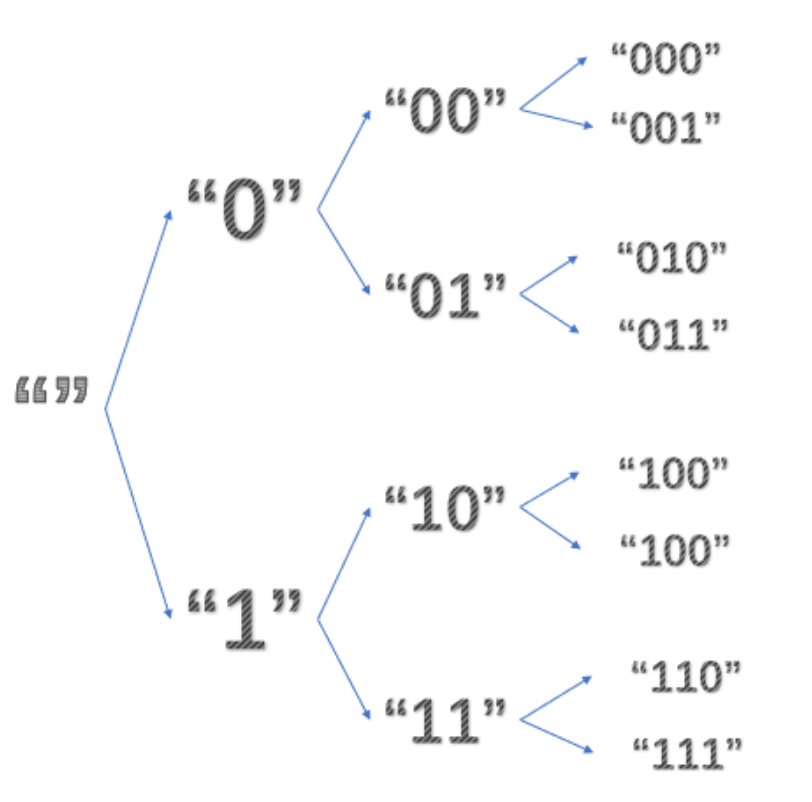

``` c
//forktree.c/umain()
forktree("")

进程 "":
-->forkchild(cur, '0');
	-->r=fork() 完成后父子进程的下一条指令都是if(r==0)
		-->set_pgfault_handler(pgfault);设好用户级页面错误处理程序
		-->who = sys_exofork();此时有两个进程，现场信息都一样,且下一条语句都是if(who==0)
			分配一个env，'UTOP以上的内存空间'与'内核该部分空间'一样。(所有进程这部分都一样)
			新进程env_tf与父进程完全一样，包括eip即下一条指令也一样，除了reg_eax即返回值不同
			新进程状态设为ENV_NOT_RUNNABLE，所以还不能运行，继续父进程
		-->for (i： 0~ PGNUM(USTACKTOP) duppage(who, i);
			将父进程'内存空间USTACKTOP以下的页面'都'复制映射'给子进程(UTOP以下=USTACKTOP以下+UXSTACKTOP(User Exception Stack))
			如果页面是可写或者COW的，则复制映射给子进程也是COW的，并重新把父进程的也映射成COW
				(当要往里面写时再调用'用户级页面错误处理程序'分配一个物理页，并重新映射到该处)
			否则就单纯复制映射就行(注意，复制映射不是复制内容)
		-->sys_page_alloc(who, (void *)(UXSTACKTOP-PGSIZE), PTE_W|PTE_U);为子进程用户异常栈分配物理页('必须')。
		-->sys_env_set_pgfault_upcall(who, _pgfault_upcall);注意此时的'who是子进程的id'
		-->sys_env_set_status(who, ENV_RUNNABLE);子进程内存空间、页面错误处理程序都设好了，可以mark它可运行了
		-->return who;父进程里返回的是子进程id
-->forkchild(cur, '1');
	同上述操作一样

此时整个用户环境空间有三个可运行的环境：父进程"",子进程"0",子进程"1"
具体CPU运行哪一个，按轮转调度程序sched_yield()

子进程"0"（或进程"1"）:
-->if(r==0){...}假设此时fork()的返回值是r，r确实为0
	-->forktree("0");操作同上面的forktree
		-->forkchild('0', '0');
		-->forkchild('1', '1');
	所以又会fork出两个新进程，进程"00"，进程"01" （或者进程"10"，进程"11"）
	
父进程""：因为r!=0，所以退出forkchild()，退出forktree(),退出umain()
-->exit() exit gracefully!

当cur长度等于3时，就不会再fork出新子进程了。而完成两次forkchild()的进程都会eixt()
当所有进程都exit()后，CPU就会进入monitor
-->sched_yield() 
-->sched_halted()
-->monitor()
```

子进程UTOP以上的内存空间什么时候初始化：在sys_exofork系统调用中，调用了env_alloc，在里面又调用了`env_setup_vm`，这个函数就把新创建的进程的`虚拟内存空间UTOP以上部分`复制了kern_pgdir中的对应部分。所以我们对子进程内存空间的操作只要管UTOP以下。

forktree中什么时候进入、怎么进入pgfault()处理的：

### Part C: Preemptive Multitasking and Inter-Process communication (IPC)

#### Interrupt discipline

##### Exercise 13

``` c
// kern/trapentry.S
TRAPHANDLER_NOEC(irq_handler0, 32);
TRAPHANDLER_NOEC(irq_handler1, 33);
TRAPHANDLER_NOEC(irq_handler2, 34);
TRAPHANDLER_NOEC(irq_handler3, 35);
TRAPHANDLER_NOEC(irq_handler4, 36);
TRAPHANDLER_NOEC(irq_handler5, 37);
TRAPHANDLER_NOEC(irq_handler6, 38);
TRAPHANDLER_NOEC(irq_handler7, 39);
TRAPHANDLER_NOEC(irq_handler8, 40);
TRAPHANDLER_NOEC(irq_handler9, 41);
TRAPHANDLER_NOEC(irq_handler10, 42);
TRAPHANDLER_NOEC(irq_handler11, 43);
TRAPHANDLER_NOEC(irq_handler12, 44);
TRAPHANDLER_NOEC(irq_handler13, 45);
TRAPHANDLER_NOEC(irq_handler14, 46);
TRAPHANDLER_NOEC(irq_handler15, 47);


// kern/trap.c
    SETGATE(idt[IRQ_OFFSET+0], 0, GD_KT, irq_handler0, 3);
    SETGATE(idt[IRQ_OFFSET+1], 0, GD_KT, irq_handler1, 3);
    SETGATE(idt[IRQ_OFFSET+2], 0, GD_KT, irq_handler2, 3);
    SETGATE(idt[IRQ_OFFSET+3], 0, GD_KT, irq_handler3, 3);
    SETGATE(idt[IRQ_OFFSET+4], 0, GD_KT, irq_handler4, 3);
    SETGATE(idt[IRQ_OFFSET+5], 0, GD_KT, irq_handler5, 3);
    SETGATE(idt[IRQ_OFFSET+6], 0, GD_KT, irq_handler6, 3);
    SETGATE(idt[IRQ_OFFSET+7], 0, GD_KT, irq_handler7, 3);
    SETGATE(idt[IRQ_OFFSET+8], 0, GD_KT, irq_handler8, 3);
    SETGATE(idt[IRQ_OFFSET+9], 0, GD_KT, irq_handler9, 3);
    SETGATE(idt[IRQ_OFFSET+10], 0, GD_KT, irq_handler10, 3);
    SETGATE(idt[IRQ_OFFSET+11], 0, GD_KT, irq_handler11, 3);
    SETGATE(idt[IRQ_OFFSET+12], 0, GD_KT, irq_handler12, 3);
    SETGATE(idt[IRQ_OFFSET+13], 0, GD_KT, irq_handler13, 3);
    SETGATE(idt[IRQ_OFFSET+14], 0, GD_KT, irq_handler14, 3);
    SETGATE(idt[IRQ_OFFSET+15], 0, GD_KT, irq_handler15, 3);
    
// kern/env.c
    // Enable interrupts while in user mode.
    // LAB 4: Your code here.
    e->env_tf.tf_eflags |= FL_IF;


```

#### Handling Clock Interrupts


##### Exercise 14

``` c
case IRQ_OFFSET + IRQ_TIMER:
    lapic_eoi();
    sched_yield();
    return;
```


#### Implementing IPC


##### Exercise 15

用户环境可以使用JOS的IPC机制`相互发送的“消息”`由两个部分组成：`一个32位的值，以及一个页面映射`。允许环境在消息中`传递页面映射`提供了一种高效的方法来`传输比单个32位整数更大的数据`，还允许环境轻松地`设置共享内存`安排。

要接收消息，环境调用sys_ipc_recv。此系统调用取消当前环境的调度(de-schedules)，并且在收到消息之前不会再次运行它。当一个环境在等待接收消息时，任何其他环境都可以向它发送消息——不仅仅是一个特定的环境，也不仅仅是与接收环境有父/子关系的环境。换句话说，您在第A部分中实现的权限检查将不适用于IPC，因为IPC系统调用是经过精心设计的，是“安全”的：一个环境不能仅仅通过发送消息就导致另一个环境发生故障(除非目标环境也有bug)。
要尝试发送一个值，环境使用接收者的环境id和要发送的值调用sys_ipc_try_send。如果指定的环境实际正在接收状态(它调用了sys_ipc_recv，但还没有获得值)，那么send将传递消息并返回0。否则，send返回-E_IPC_NOT_RECV，表示目标环境当前不期望接收值

用户空间中的库函数`ipc_recv`将负责`调用sys_ipc_recv`，然后在当前环境的`struct Env`中查找关于接收值的信息

类似地，库函数`ipc_send`将负责`重复调用sys_ipc_try_send`，直到发送成功

当环境使用有效的dstva参数(UTOP以下)调用sys_ipc_recv时，环境声明它愿意接收页面映射。如果发送方发送了一个页面，那么该页面应该映射到接收方地址空间中的dstva。如果接收方已经在dstva上映射了一个页面，则将前一个页面映射取消。

当环境使用有效的srcva (UTOP以下)调用sys_ipc_try_send时，这意味着发送方希望将当前映射在srcva的权限为perm的页面发送给接收方。成功完成IPC之后，发送方将页面的原始映射保存在地址空间中的srcva，但是接收方也在接收方的地址空间中获得相同物理页面的映射，该映射位于接收方最初指定的dstva。因此，此页面在发送方和接收方之间共享。

如果发送方或接收方都没有表示应该传输页面，则不传输任何页面。在任何IPC之后，内核将接收方的Env结构中的新字段env_ipc_perm设置为接收页的权限，如果没有接收页，则设置为零


``` c
// kern/syscall.c
static int
sys_ipc_recv(void *dstva)
{
    if ((uint32_t)dstva < UTOP && PGOFF(dstva) != 0) {
        return -E_INVAL;
    }
   // block 直到接到“消息”，即curenv的%eax没有返回值
    curenv->env_ipc_recving = 1;
    curenv->env_ipc_dstva = dstva;
  // 不需要显示使用sched_yield()，设置好status就好
    curenv->env_status = ENV_NOT_RUNNABLE;
  	sched_yield();
    return 0;
}

static int
sys_ipc_try_send(envid_t envid, uint32_t value, void *srcva, unsigned perm)
{
    struct Env *e;
    struct PageInfo *pp;
    pte_t *pte;
    int r;

    if ((r = envid2env(envid, &e, 0)) != 0) {
        return r;
    }
    if (e->env_ipc_recving == 0) {
        return -E_IPC_NOT_RECV;
    }
    if ((uint32_t)srcva < UTOP) {
        if (PGOFF(srcva) != 0) {
            return -E_INVAL;
        }
        if ((perm & (PTE_U | PTE_P)) != (PTE_U | PTE_P)) {
            return -E_INVAL;
        }
        if ((perm & ~(PTE_SYSCALL)) != 0) {
            return -E_INVAL;
        }
        if ((pp = page_lookup(curenv->env_pgdir, srcva, &pte)) == NULL) {
            return -E_INVAL;
        }
        if ((*pte & PTE_W) == 0 && (perm & PTE_W) == PTE_W) {
            return -E_INVAL;
        }
      // 不能使用sys_page_map,因为权限更严格，而send只需要检查envid是否有效
        if ((r = page_insert(e->env_pgdir, pp, e->env_ipc_dstva, perm)) != 0) {
            return r;
        }
        e->env_ipc_perm = perm;
    } else {
        e->env_ipc_perm = 0;
    }
   // unblock
    e->env_ipc_recving = 0;
    e->env_ipc_from = curenv->env_id;
    e->env_ipc_value = value;
    e->env_status = ENV_RUNNABLE;
  // The target environment is marked runnable again, returning 0
	// from the paused sys_ipc_recv system call
    e->env_tf.tf_regs.reg_eax = 0;
    return 0;
}

int32_t
ipc_recv(envid_t *from_env_store, void *pg, int *perm_store)
{
    int r;

    if (pg == NULL) {
      // Zero is not the right value
        pg = (void *)UTOP;
    }
    if ((r = sys_ipc_recv(pg)) < 0) {
        if (from_env_store != NULL) {
            *from_env_store = 0;
        }
        if (perm_store != NULL) {
            *perm_store = 0;
        }
        return r;
    }
    if (from_env_store != NULL) {
        *from_env_store = thisenv->env_ipc_from;
    }
    if (perm_store != NULL) {
        *perm_store = thisenv->env_ipc_perm;
    }
    return thisenv->env_ipc_value;
}

void
ipc_send(envid_t to_env, uint32_t val, void *pg, int perm)
{
    int r;

    if (pg == NULL) {
        pg = (void *)UTOP;
    }
    do {
      // 继续发送权限为perm的pg，以便共享页面
        r = sys_ipc_try_send(to_env, val, pg, perm);
        if (r < 0 && r != -E_IPC_NOT_RECV) {
            panic("ipc_send: %e", r);
        }
        sys_yield();
    } while(r != 0);
}

```

IPC是Inter-Process Communication。PIC是Programmable Interrupt Control。

两个系统调用sys_ipc_try_send()和sys_ipc_recv()之间的配合。
curenv进入接收状态(设好dstva，from=0证明还没环境发送成功，recving=1，stats=ENV_NOT_RUNABLE锁住直到接到"消息")，并让出CPU。要注意的是，除非发生error，否则sys_ipc_recv()是没有返回值的。也就是说curenv的%eax将会没有返回值，那怎么办
不用担心，sys_ipc_try_send为你解决一切烦恼。在对自己进行详细审查后才准备发"消息"，如果sendenv发送“消息”成功了，它会贴心的帮recvenv设置好env_ipc_*，并让recvenv->env_status=ENV_RUNNABLE，甚至给recvenv的%eax赋值0提醒recvenv它收到"消息"了

sendpage.c

``` c
//sendpage.c/umain()
//只启动了一个CPU
父进程：who=fork(),产生子进程，两个进程基本一样，
		-->下一条语句都是if(who==0){...}
		
-->父进程：
-->sys_page_alloc(thisenv->env_id, TEMP_ADDR, PTE_P | PTE_W | PTE_U);
-->memcpy(TEMP_ADDR, str1, strlen(str1) + 1);
-->ipc_send(who, 0, TEMP_ADDR, PTE_P | PTE_W | PTE_U);此时who是子进程id
	-->r=sys_ipc_try_send(to_env, val, pg, perm);
	-->由于子进程不是接收状态，得到r=-E_IPC_NOT_RECV
	-->sys_yield()主动放弃CPU，所以子进程得到CPU

-->子进程进入if循环：
-->ipc_recv(&who, TEMP_ADDR_CHILD, 0); 此时who是from_env，是父进程id
	-->r=sys_ipc_recv(pg);进入接收状态并让出CPU
	设好'dstva'，'from=0'证明还没环境发送成功，'recving=1，stats=ENV_NOT_RUNABLE'锁住直到接到"消息"

-->父进程此时还在轮询sys_ipc_try_send()：
	-->r=sys_ipc_try_send(to_env, val, pg, perm);
	发现子进程进入接收状态，在对自己进行`详细审查`后才准备发"消息"，
	发送"消息"成功了，它会贴心的帮recvenv设置好'env_ipc_*'，
	并让'recvenv->env_status=ENV_RUNNABLE'，甚至给`recvenv的%eax赋值0`提醒recvenv它收到"消息"了
	-->发送成功，返回0，退出ipc_send()
-->ipc_recv(&who, TEMP_ADDR, 0);
	-->r=sys_ipc_recv(pg);进入接收状态并让出CPU

-->子进程还在ipc_recv()里。不过此时已经接收"页面"并映射到TEMP_ADDR_CHILD了,并由父进程的sys_ipc_try_send修复好了状态
	-->*from_env_store=父进程id
	-->*perm_store=perm
-->cprintf("%x got message: %s\n", who, TEMP_ADDR_CHILD);打印处接收到的信息
-->cprintf("child received correct message\n");验证信息是否正确
-->memcpy(TEMP_ADDR_CHILD, str2, strlen(str2) + 1);向TEMP_ADDR_CHILD写入新内容str2
-->ipc_send(who, 0, TEMP_ADDR_CHILD, PTE_P | PTE_W | PTE_U);
将TEMP_ADDR_CHILD对应页面发给父进程。此时的who由子进程的ipc_recv()赋值了父进程id
并且此时父进程已经由ipc_recv()进入了接收状态，所以子进程可以直接发送成功，不用让出CPU
-->return
-->exit()那子进程到这就exit gracefully了，寿终正寝

-->父进程还在ipc_recv()里:也已经收到子进程的信息了，所以退出ipc_recv()，且此时who又指向了子进程id
-->cprintf("%x got message: %s\n", who, TEMP_ADDR_CHILD);打印处接收到的信息
-->cprintf("child received correct message\n");验证信息是否正确
-->return
-->exit()至此，父进程也完成任务exit gracefully

-->monitor()CPU由于没有进程可执行，在sched_halted里进入monitor


```

## lab5: File system, Spawn and Shell


我们没有采用传统的“单片”操作系统策略，即在内核中添加IDE磁盘驱动程序以及允许文件系统访问它的必要的系统调用，而是将`IDE磁盘驱动程序`实现为`用户级文件系统环境的一部分`

### The File System


#### Disk Access


##### Exercise 1

``` c
// If this is the file server (type == ENV_TYPE_FS) give it I/O privileges.
if (type == ENV_TYPE_FS) {
    env->env_tf.tf_eflags |= FL_IOPL_MASK;
}

```

###### Question 1

不需要，因为在eflags中，切换env的时候会自动切换

#### The Block Cache


##### Exercise 2

``` c
// bc_pgfault
addr = ROUNDDOWN(addr, PGSIZE);
// 0 represent the current environment
// 从磁盘加载页面来响应page fault
if ((r = sys_page_alloc(0, addr, PTE_W | PTE_U | PTE_P)) != 0) {
    panic("bc_pgfault: %e", r);
}
// sector not page as a unit
if ((r = ide_read(blockno * BLKSECTS, addr, BLKSECTS)) != 0) {
    panic("bc_pgfault: %e", r);
}

// flush_block
void
flush_block(void *addr)
{
	uint32_t blockno = ((uint32_t)addr - DISKMAP) / BLKSIZE;
	int r;

	if (addr < (void*)DISKMAP || addr >= (void*)(DISKMAP + DISKSIZE))
		panic("flush_block of bad va %08x", addr);

	// LAB 5: Your code here.
	// panic("flush_block not implemented");

	// addr = ROUNDDOWN(addr, PGSIZE);

	if(!va_is_mapped(addr) || !va_is_dirty(addr)){
		return;
	}

	addr = ROUNDDOWN(addr, PGSIZE);

	if((r = ide_write(blockno* BLKSECTS, addr, BLKSECTS)) != 0) {
		panic("flush_block: %e", r);
	}
	// uvpt[PGNUM(addr)] learn from va_is_mapped
	if((r = sys_page_map(0, addr, 0, addr, uvpt[PGNUM(addr)]&PTE_SYSCALL)) != 0){
		panic("flush_block: %e", r);
	}
}
```


#### The Block Bitmap


##### Exercise 3

``` c
int
alloc_block(void)
{
	for (int i=0; i<super->s_nblocks; i++){
		if(block_is_free(i)){
      // A single bitmap block contains the in-use bits for BLKBITSIZE blocks.
      // 其中 BLKBITSIZE 为4*8=32，故只有32位，blockno通过对32取余，记录所谓的bit位
      // 索引通过除32的得到，通过索引+bit位，这样就可以确定blockno
			bitmap[i/32] &= ~(1 << (i%32));
      // 与 free相反
			flush_block(bitmap);
			return i;
		}
	}

	return -E_NO_DISK;
}
```


#### File Operations


##### Exercise 4

``` c
static int
file_block_walk(struct File *f, uint32_t filebno, uint32_t **ppdiskbno, bool alloc)
{
    if (filebno >= NDIRECT + NINDIRECT) {
        return -E_INVAL;
    }
    if (filebno < NDIRECT) {
        *ppdiskbno = &f->f_direct[filebno];
    } else {
        if (!f->f_indirect && !alloc) {
            return -E_NOT_FOUND;
        }
        if (!f->f_indirect && alloc) {
            uint32_t newbno;

            if ((newbno = alloc_block()) < 0) {
                return -E_NO_DISK;
            }
            f->f_indirect = newbno;
          // 记得初始化,相当于"clear any block you allocate"
            memset(diskaddr(newbno), 0, BLKSIZE);
        }
      // 即f->f_indirect与f->f_direct都是存着块号，而*ppdiskbno要的是存着块号的那个槽的地址
        *ppdiskbno = &((uint32_t *)diskaddr(f->f_indirect))[filebno - NDIRECT];
    }
    return 0;
}

int
file_get_block(struct File *f, uint32_t filebno, char **blk)
{
    uint32_t *pdiskbno; // f的filebno块的块号所在的slot的地址
    int r;

    if ((r = file_block_walk(f, filebno, &pdiskbno, 1)) != 0) {
        return r;
    }
    if (!*pdiskbno) {
        uint32_t newbno;

        if ((newbno = alloc_block()) < 0) {
            return -E_NO_DISK;
        }
        *pdiskbno = newbno;
        memset(diskaddr(newbno), 0, BLKSIZE);
    }
    *blk = diskaddr(*pdiskbno);
    return 0;
}
// 到底需不需要flush_block

```

#### The file system interface


##### Exercise 5

明确概念：

* 在客户端，我们总是在`fsipcbuf`共享页面;在服务器端，我们将传入的请求页面映射到`fsreq (0x0ffff000)`
* `设备结构体dev`，设备有三种，devfile,devpipe,devcons
* 服务端的私有结构体`OpenFile`
* 保存着open file基本信息的`Fd page`页面(在内存空间0xD0000000(FDTABLE)以上)
* `设备结构体dev`，设备有三种，devfile,devpipe,devcons
* OpenFile->o_fileid跟OpenFile->o_fd->fd_file.id以及Fsipc->read->req_fileid的关系!

read流程

``` c
//inc/fd.h
struct Fd {
	int fd_dev_id;
	off_t fd_offset;
	int fd_omode;
	union {
		// File server files
		// 这应该就是目标文件id，在客户端赋值给了fsipcbuf.read.req_fileid
		struct FdFile fd_file; //struct FdFile {int id; };
	};
};

//fs/serv.c
struct OpenFile { //This memory is kept private to the file server.
	uint32_t o_fileid;	// file id。 The client uses file IDs to communicate with the server.
	struct File *o_file;	// mapped descriptor for open file应该是打开的那个文件的file pointer
	int o_mode;		// open mode
	struct Fd *o_fd;	// Fd page是一个专门记录着这个open file的基本信息的页面
};

//inc/fs.h
struct File {
	char f_name[MAXNAMELEN];	// filename
	off_t f_size;			// file size in bytes
	uint32_t f_type;		// file type

	// Block pointers.
	// A block is allocated iff its value is != 0.
	// 这里存的是块号
	uint32_t f_direct[NDIRECT];	// direct blocks
	uint32_t f_indirect;		// indirect block

	// Pad out to 256 bytes; must do arithmetic in case we're compiling
	// fsformat on a 64-bit machine.
	// 扩展到256字节;必须做算术，以防我们在64位机器上编译fsformat。
	uint8_t f_pad[256 - MAXNAMELEN - 8 - 4*NDIRECT - 4];
} __attribute__((packed));	// required only on some 64-bit machines

```

*lib/fd.c/read()*

``` c
// 根据fdnum在内存空间0xD0000000以上找到一个struct Fd页面命名为fd，
// 页面内保存着一个open file的基本信息。然后根据fd内的fd_dev_id找到对应设备dev，
// 很明显这里是devfile，然后调用(*devfile->dev_read)(fd, buf, n)。该函数返回读到的字节总数

ssize_t read(int fdnum, void *buf, size_t n)
{
	int r;
	struct Dev *dev;7
	struct Fd *fd;

	if ((r = fd_lookup(fdnum, &fd)) < 0
	    || (r = dev_lookup(fd->fd_dev_id, &dev)) < 0)
		return r;
	if ((fd->fd_omode & O_ACCMODE) == O_WRONLY) {
		cprintf("[%08x] read %d -- bad mode\n", thisenv->env_id, fdnum);
		return -E_INVAL;
	}
	if (!dev->dev_read)
		return -E_NOT_SUPP;
	return (*dev->dev_read)(fd, buf, n);
}

```

*lib/file.c/devfile_read()*

``` c
// 通过IPC共享的页面上的union Fsipc中存储请求的参数。在客户端，我们是在 
// fsipcbuf共享页面。设置好fsipcbuf的参数，调用fsipc去向服务器端发送read请求。
// 请求成功后结果也是保存在共享页面fsipcbuf中，然后读到指定的buf就行。
static ssize_t devfile_read(struct Fd *fd, void *buf, size_t n)
{
	// Make an FSREQ_READ request to the file system server after
	// filling fsipcbuf.read with the request arguments.  The
	// bytes read will be written back to fsipcbuf by the file
	// system server.
	int r;

	fsipcbuf.read.req_fileid = fd->fd_file.id;// 赋值目标文件id
	fsipcbuf.read.req_n = n;
	if ((r = fsipc(FSREQ_READ, NULL)) < 0)
		return r;
	assert(r <= n);
	assert(r <= PGSIZE);
	memmove(buf, fsipcbuf.readRet.ret_buf, r);
	return r;
}

```

*lib/file.c/fsipc()*

``` c
// 负责跟文件系统server进程间通信,获取file server的envid_t,随便哪个都行
static int fsipc(unsigned type, void *dstva)
{
	static envid_t fsenv;
	if (fsenv == 0)
		fsenv = ipc_find_env(ENV_TYPE_FS);

	static_assert(sizeof(fsipcbuf) == PGSIZE);

	if (debug)
		cprintf("[%08x] fsipc %d %08x\n", thisenv->env_id, type, *(uint32_t *)&fsipcbuf);

	ipc_send(fsenv, type, &fsipcbuf, PTE_P | PTE_W | PTE_U);
	return ipc_recv(NULL, dstva, NULL);
}

```

*fs/serv.c/serve()*

``` c
// ipc_recv的返回值是32位字env_ipc_value，即fsipc里ipc_send过来的type，根据
// 这个type判断进入哪个处理函数，这里很明显type==FSREQ_READ
void serve(void)
{
	uint32_t req, whom;
	int perm, r;
	void *pg;

	while (1) {
		perm = 0;
		req = ipc_recv((int32_t *) &whom, fsreq, &perm);
		if (debug)
			cprintf("fs req %d from %08x [page %08x: %s]\n",
				req, whom, uvpt[PGNUM(fsreq)], fsreq);

		// All requests must contain an argument page
		if (!(perm & PTE_P)) {
			cprintf("Invalid request from %08x: no argument page\n",
				whom);
			continue; // just leave it hanging...
		}

		pg = NULL;
		if (req == FSREQ_OPEN) {
			r = serve_open(whom, (struct Fsreq_open*)fsreq, &pg, &perm);
		} else if (req < ARRAY_SIZE(handlers) && handlers[req]) {
			r = handlers[req](whom, fsreq);
		} else {
			cprintf("Invalid request code %d from %08x\n", req, whom);
			r = -E_INVAL;
		}
		ipc_send(whom, r, pg, perm);
		sys_page_unmap(0, fsreq);
	}
}

```

*fs/serv.c/serve_read()*

``` c
// 首先找到ipc->read->req_fileid对应的OpenFile，然后调用file_read去读内容到
// ipc->readRet->ret_buf
int serve_read(envid_t envid, union Fsipc *ipc)
{
	struct Fsreq_read *req = &ipc->read;
	struct Fsret_read *ret = &ipc->readRet;
	struct OpenFile *o;
	int r;
	
	if (debug)
		cprintf("serve_read %08x %08x %08x\n", envid, req->req_fileid, req->req_n);

	// Lab 5: Your code here:
	// First, use openfile_lookup to find the relevant open file.
	// On failure, return the error code to the client with ipc_send.
	if ((r = openfile_lookup(envid, req->req_fileid, &o)) < 0)
		return r;
	if((r = file_read(o->o_file, ret->ret_buf, req->req_n, o->o_fd->fd_offset))<0)
		return r;
	o->o_fd->fd_offset += r; //then update the seek position这个才是位置！
	//req->req_fileid = o->o_fd->fd_file.id;
	//cprintf("o->o_file:%lld req->req_fileid:%lld o->o_fd->fd_file:%d\n",o->o_fileid, req->req_fileid,o->o_fd->fd_file.id);
	return r;
}

```

*fs/fs.c/file_read()*

``` c
// 将文件f从offset开始的count个字节读入buf中。但是count可能大于f->f_size-
// offset，那么最多也只能把文件剩余部分读出。
ssize_t
file_read(struct File *f, void *buf, size_t count, off_t offset)
{       
        int r, bn;
        off_t pos;
        char *blk;
 
        if (offset >= f->f_size)
                return 0;
        
        count = MIN(count, f->f_size - offset);
        
        for (pos = offset; pos < offset + count; ) {
        		//将f的第filebno块的虚拟地址存到blk中
                if ((r = file_get_block(f, pos / BLKSIZE, &blk)) < 0)
                        return r;
                bn = MIN(BLKSIZE - pos % BLKSIZE, offset + count - pos);
                memmove(buf, blk + pos % BLKSIZE, bn);
                pos += bn;
                buf += bn;
        }       

        return count;
}

```


``` c
int
serve_read(envid_t envid, union Fsipc *ipc)
{
    struct Fsreq_read *req = &ipc->read;
    struct Fsret_read *ret = &ipc->readRet;
    struct OpenFile *o;
    int r;

    if (debug)
        cprintf("serve_read %08x %08x %08x\n", envid, req->req_fileid, req->req_n);

    if ((r = openfile_lookup(envid, req->req_fileid, &o)) != 0) {
        return r;
    }
    if ((r = file_read(o->o_file, ret->ret_buf, req->req_n, o->o_fd->fd_offset)) > 0) {
        o->o_fd->fd_offset += r;
    }
    return r;
}

```

##### Exercise 6

``` c
// 同样先找到req->req_fileid对应的OpenFIle，然后将req->req_buf中req->req_n个字节的内容写到OpenFile
// 的fd_offset处。
int
serve_write(envid_t envid, struct Fsreq_write *req)
{
    struct OpenFile *o;
    int r;

    if (debug)
        cprintf("serve_write %08x %08x %08x\n", envid, req->req_fileid, req->req_n);

    if ((r = openfile_lookup(envid, req->req_fileid, &o)) != 0) {
        return r;
    }
    if ((r = file_write(o->o_file, req->req_buf, req->req_n, o->o_fd->fd_offset)) > 0) {
        o->o_fd->fd_offset += r;
    }
    return r;
}

static ssize_t
devfile_write(struct Fd *fd, const void *buf, size_t n)
{
    int r;

    fsipcbuf.write.req_fileid = fd->fd_file.id;
    fsipcbuf.write.req_n = n;
    assert(n <= PGSIZE - (sizeof(int) + sizeof(size_t)));
    memmove(fsipcbuf.write.req_buf, buf, n);
    if ((r = fsipc(FSREQ_WRITE, NULL)) < 0)
        return r;
    assert(r <= n);
    return r;
}

```

在`testfile.c`源码中都是使用的`write`,`open`,`read`等被抽象的操作，而实际的过程比如`write`操作会被分发到`devfile_write`通过IPC发送写信号并且共享传递的页，文件系统进程收到写信号并将传递过来的页映射在一个固定的位置，找到文件描述符所指定的文件，然后将共享页buf中的内容复制到磁盘映射页上面，最后在关闭文件的时候flush进行保存；文件系统服务端这边处理完文件后，会把文件写操作的字节数返回做为操作成功的信号通过IPC返回给客户端，并且取消映射共享页。给人的直接感受就是，操作者通过`write`操作直接写入了文件中。

#### Spawning Processes


##### Exercise 7

Spawn`创建一个新环境`，从文件系统`加载一个程序映像`到其中，然后`启动运行`这个程序的子环境。然后父进程继续独立于子进程运行。spawn函数的作用类似于UNIX中的fork，然后在子进程中`立即执行exec`。

``` c
static int
sys_env_set_trapframe(envid_t envid, struct Trapframe *tf)
{
    struct Env *e;
    int r;

    if ((r = envid2env(envid, &e, 1)) != 0) {
        return r;
    }
    user_mem_assert(e, tf, sizeof(struct Trapframe), PTE_W);
    tf->tf_cs |= 3;
    tf->tf_ss |= 3;
    tf->tf_eflags |= FL_IF;
    tf->tf_eflags &= ~FL_IOPL_3;
    e->env_tf = *tf;
    return 0;
}

```

#### Sharing library state across fork and spawn


##### Exercise 8

``` c
@@ -64,7 +64,11 @@ duppage(envid_t envid, unsigned pn)
        void *va = (void *)(pn * PGSIZE);
        int r;

-       if ((uvpt[pn] & PTE_W) == PTE_W || (uvpt[pn] & PTE_COW) == PTE_COW) {
+       if ((uvpt[pn] & PTE_SHARE) == PTE_SHARE) {
+               if ((r = sys_page_map(parent_envid, va, envid, va, uvpt[pn] & PTE_SYSCALL)) != 0) {
+                       panic("duppage: %e", r);
+               }
+       } else if ((uvpt[pn] & PTE_W) == PTE_W || (uvpt[pn] & PTE_COW) == PTE_COW) {
                if ((r = sys_page_map(parent_envid, va, envid, va, PTE_COW | PTE_U | PTE_P)) != 0) {
                        panic("duppage: %e", r);
                }

 static int
copy_shared_pages(envid_t child)
{
    envid_t parent_envid = sys_getenvid();
    uint32_t addr;
    int r;

    for (addr = 0; addr < USTACKTOP; addr += PGSIZE) {
      // uvpd、uvpt应该是个全局数组变量，但是数组元素对应的pde、pte具体是什么
      // 应该取决于lcr3设置的是哪个环境的内存空间
        if ((uvpd[PDX(addr)] & PTE_P) == PTE_P && (uvpt[PGNUM(addr)] & PTE_P) == PTE_P && (uvpt[PGNUM(addr)] & PTE_SHARE) == PTE_SHARE) {
            if ((r = sys_page_map(parent_envid, (void *)addr, child, (void *)addr, uvpt[PGNUM(addr)] & PTE_SYSCALL)) != 0) {
                panic("copy_shared_pages: %e", r);
            }
        }
    }
    return 0;
}

```

#### The keyboard interface


##### Exercise 9

``` c
case IRQ_OFFSET + IRQ_KBD:
    kbd_intr();
    return;
case IRQ_OFFSET + IRQ_SERIAL:
    serial_intr();
    return;

```

#### The Shell


##### Exercise 10

``` c
@@ -56,3 +56,9 @@ again:
-                       // LAB 5: Your code here.
-                       panic("< redirection not implemented");
+                       if ((fd = open(t, O_RDONLY)) < 0) {
+                               cprintf("open %s for read: %e", t, fd);
+                               exit();
+                       }
+                       if (fd != 0) {
+                               dup(fd, 0);
+                               close(fd);
+                       }
                        break;

```

seek position是什么，open file是什么

* position指的是请求从读/写的目标文件开始读/写的位置，是一个偏移量，保存在fd->fd_offset
* openfile 的流程
  1. 客户端首先在`0xD0000000`以上找到一个`还未映射物理页`的地址`fd`，然后传给server一个`path`
  2. server 根据path打开或者创建一个`open file`，然后传回`Fd page`(存着被打开文件的基本信息)给客户端caller，`映射在fd上`


Jos提供的文件系统

文件系统根本`不使用inode`，而只是在描述该文件的(唯一的)`目录条目`中存储文件(或子目录)的`所有元数据`。

文件系统通常将某些磁盘块保留在磁盘上某个"容易找到"的地方(例如最开始或者最末端)去保存描述整个文件系统属性的元数据，比如block size、disk size、查找root directory所需的任何元数据、最后一次挂载文件系统的时间、最后一次检查文件系统是否出错的时间等等。这些特殊的块就是superblocks

我们的文件系统将只有一个超级块，它总是在磁盘上的block 1(第二块)。它的布局是由struct Super在inc/fs.h中定义的。block 0通常保留用于保存boot loaders和partition tables(分区表)，因此文件系统通常不使用第一个磁盘块。许多“real”文件系统有多个超级块，这些超级块复制到磁盘的多个widely-space(宽间距)区域，因此，如果其中一个超级块损坏了，或者磁盘在该区域出现了media错误，仍然可以找到其他超级块，并使用它们访问文件系统。

文件系统中描述文件的元数据的布局由inc/fs.h中的struct file描述。这个元数据包括文件的名称、大小、类型(常规文件或目录)和指向组成文件的块的指针。如上所述，我们没有inode，所以这个元数据存储在磁盘上的目录条目中。与大多数“real”文件系统不同，为了简单起见，我们将使用这个File structure来表示文件元数据，因为它同时出现在磁盘和内存中。

struct File中的f_direct数组包含存储文件前10个(NDIRECT)块的块号的空间，我们称之为文件的直接块。对于大小高达10*4096B = 40KB的小文件，这意味着所有文件块的块号将直接适合File structure 本身。但是，对于较大的文件，我们需要一个地方来保存文件的其余块号。因此，对于任何大于40KB的文件，我们分配一个额外的磁盘块，称为文件的间接块，以容纳4096/4 = 1024个额外的块号。

文件系统中的File structure既可以表示普通文件，也可以表示目录;这两种类型的“files”由文件结构中的type字段来区分。文件系统以完全相同的方式管理常规文件和目录文件,除了它不解释与常规文件相关联的数据块的内容,而文件系统将目录文件的内容解释为该目录中的一系列描述文件和子目录的File structure。

我们的文件系统中的superblock含一个File structure(struct Super中的root字段)，它保存文件系统根目录的元数据。这个目录文件的内容是描述文件系统根目录中的文件和目录的File structure序列。根目录中的任何子目录都可能包含更多表示子-子目录的文件结构，依此类推
我们依赖于polling(轮询)、基于“programmed I/O”(PIO)的磁盘访问，并且不使用磁盘中断，就很容易在用户空间中实现磁盘访问。

x86处理器使用EFLAGS寄存器中的IOPL位来确定是否允许保护模式代码执行特殊的设备I/O指令，比如IN和OUT指令。即如果为新创建的环境设置了env_tf.tf_eflags的IOPL位，那该环境就能访问磁盘，属于文件系统环境。


文件系统环境的0x10000000到0xD0000000作为磁盘的内存映射区域，是一一对应的，只是一个块对应磁盘8个扇区。但要注意两点，
一、仅文件系统环境的该区域才是这样，普通环境可不这样，这是虚拟内存的强大之处。
二、并不是一开始就把整个磁盘内容都加载进该区域，而是等想要访问文件了，读取对应块时引发页面错误，然后通过bc_pgfault()函数再去加载内容到内存中

open的流程

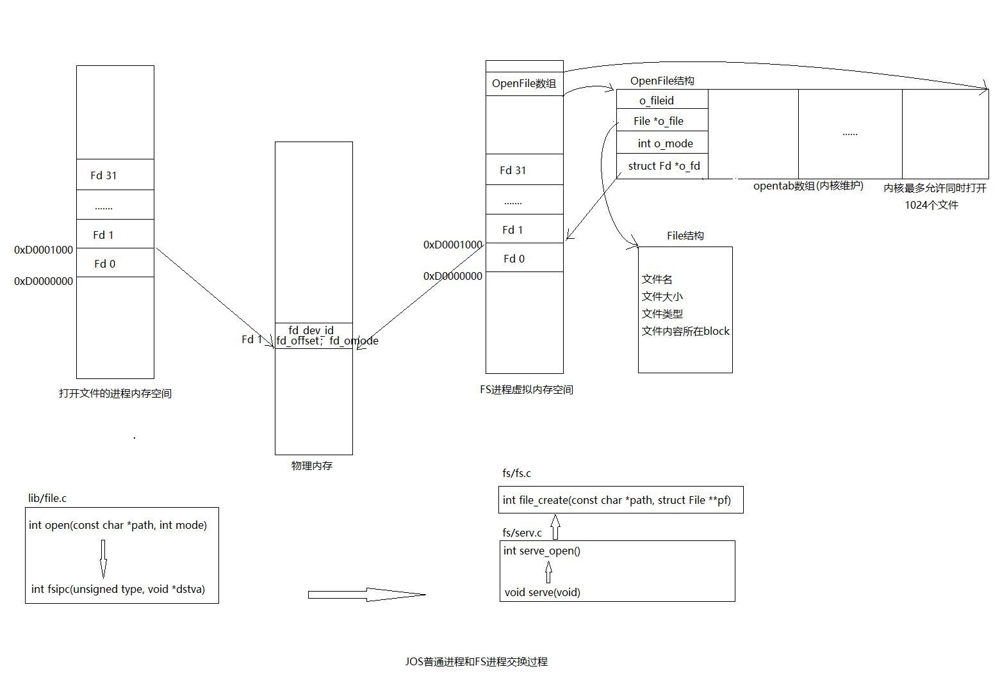

``` c
lib/file.c，在'普通环境下':
open(path, mode)
	->fd_alloc(&fd) 每个OpenFIle都有'文件描述符fd'，这里只是在当前env的FDTABLE(0xD0000000)以上，
					找一个未映射物理页的虚拟地址，到时候会将OpenFile对应的'Fd page'映射在此处
	->fsipcbuf.open设好值，path跟mode
	->fsipc(FSREQ_OPEN, fd) 
		->fsenv 找个文件系统环境来帮忙
		->ipc_send(fsenv, type, &fsipcbuf, PTE_P | PTE_W | PTE_U); 
		  想fsenv发送ipc请求，value='FSREQ_OPEN'作为type，
		  并将fsipcbuf映射的物理页以perm权限映射到fsenv->env_ipc_dstva(即fsreq)处


fs/serv.c: 此时运行的是'文件系统环境'，会在serv.c/umain()下完成serve_init、fs_init、fs_test然后调用serve()
serv()
	->req = ipc_recv((int32_t *) &whom, fsreq, &perm); 
	  whom应该指'普通env'，'fsreq'作为dstva，req=type='FSREQ_OPEN'
	->serve_open(whom, (struct Fsreq_open*)fsreq, &pg, &perm); 返回0或者error
	  以fsreq->req_omode模式打开fsreq->req_path处的文件，并将其Fd page (映射好了物理页的虚拟地址)赋给pg
		
		->r=openfile_alloc(&o) 从'opentab[]'中选一个o_fd对应物理页的ref<=1的OpenFile给o，r为其o_fd
		->if(设置了O_CREAT位)
			->file_create(path, &f) 创建"path"，成功的话f指向被创建的file
				->r=walk_path(path, &dir, &f, name) 
				  此时应该r == -E_NOT_FOUND，证明当前环境映射着磁盘的内存区域找不到目标文件
				  从s_root开始，找到path对应的File，此时'dir!=0'，证明不会出现中间path就找不到的情况，否则直接返回error
				  		所以name肯定指向final path，dir指向其上一级目录。否则返回error
				  这里的找就是在磁盘的"内存映射区域"(0x10000000~0xD0000000)找
				  	  ->r=dir_lookup(dir, name, &f) 找到dir下名为name的File，让f指向它，这里应该是f=0，返回r==-E_NOT_FOUND
				->dir_alloc_file(dir, &f) 在dir下找一个'free File structure '(其实就是找个'空闲块')给f
		->else file_open(path, &f);
					->简单调用walk_path(path, 0, pf, 0)只要根据path找到f就行了
		->为打开的文件设置好相应的数据。'Openfild->o_file、o_mode、o_fd'等

	->回到serve()，调用ipc_send(whom,r,pg,perm) 此时whom是普通env，r是serve_open的结果，pg是Fd page，perm=PTE_P|PTE_U|PTE_W|PTE_SHARE
	->sys_page_unmap(0,fsreq)请求处理完了，自然要解除对之前发过来的共享页面的映射fsreq


lib/file.c,这里又是在'普通环境'了，回到fsipc()：
		->ipc_recv(NULL,dstva,NULL); //将发过来的Fd page映射在之前分配好的虚拟地址fd上
	->回到open()，return fd2num(fd);

```

Spawn流程

Spawn(prog, argv)会根据`路径prog`打开文件，从文件中获取二进制映像`elf header`，然后根据elf header完成其`内存空间的加载`。

主要是要设好`agrv[]数组`，这样可以设好子环境的`用户栈`，方便子环境执行时从中获得`所需参数`

Spawn跟fork的区别是，fork出的子环境跟父环境除了返回值外，`上下文跟内存空间`都几乎`一模一样`。而Spawn出的子环境会从文件中加载`内存空间，跟父环境完全不一样`，而且`eip、esp、用户栈都不一样`，但是`SHARE权限页面`是共享的

``` c
// 输入make run-icode，执行完1386_init()中的那些初始化，创建好icode环境，开始make_run -> env_pop_tf -> 
// lib/entry.s/_start ->libmain -> user/icode.c/umain，至于为什么可以准确调用user/icode.c/umain，
// ENV_CREATE(init.c:54)时，根据对应二进制映像文件obj/user/icode.img，加载到环境内存中的就是fs/serv.c/umain
// 这个程序，所以可以准确调用到。
// 同理，后面的文件系统环境运行到libmain后，也可以准确调用到fs/serv.c/umain，因为创建时根据obj/fs/fs.img加
// 载的就是fs/serv.c/umain。

// icode流程，即Spawn使用流程
user/icode.c/umain():
->binaryname = "icode"; 
->fd = open("/motd", O_RDONLY) 具体见上
		->fsipc()->ipc_send()->sched_yield() 让出CPU资源并等待结果

完成FS环境创建，并进入fs/serv.c/umain():
->serve_init() 初始化'opentab[]'数组(initialize to force into data section)
->fs_init() 选择一块合适的磁盘，优先第二块磁盘disk 1
	->bc_init() 设好bc_pgfault,检查bc的superblock是否可用，将第二个磁盘块(指的FS环境内存空间DISKMAP以上的第二个虚拟页)内容给super
	->让super指向diskaddr(1),并check_super()
	->让bitmap指向diskaddr(2)，但是bitmap并不只有一个块，JOS中最多可以有24块，然后check_bitmap()
->fs_test() 检查block_alloc、file_open、file_set_size、file_flush、file_get_block、file_rewrite等，本身就是文件系统环境，可以直接访问
->serve()
	->ipc_recv()->serve_open()->ipc_send()主要是发回Fd page->sched_yield()->sys_page_unmap()具体见上一个流程

打开文件成功，回到icode环境，Fd page对应的物理页映射在fd上，user/icode.c/umain():
->n = read(fd, buf, sizeof buf-1) 再次向FS环境发送请求，从fd代表的OpenFile保存的文件File中读sizeof(buf-1)个字节到buf
		->devfile_read()->fsipc()->ipc_send()->sched_yield()

又切换到FS环境处理read请求。
->serve() 一直在while(1)看是否有ipc_send过来
	->ipc_recv()->serve_read()->ipc_send()读出的内容就存在共享页面fsreq中->sched_yield()->sys_page_unmap()

再次回到icode环境，sys_cputs输出读到的内容
->close(fd) // 解除fd上对Fd page的映射
->r = spawnl("/init", "init", "initarg1", "initarg2", (char*)0) 将后面4个参数都存到argv[]中，然后调用spawn(prog,argv)
	->spawn("/init",argv) 返回的是生成的子环境的id
		->fd = open(prog, O_RDONLY)
		->readn(fd, elf_buf, sizeof(elf_buf)) 根据fd读出elf healder
		->child = sys_exofork() 创建一个子进程，与父进程有着几乎一样的上下文，状态NOT_RUNNABLE
		->r = init_stack(child, argv, &child_tf.tf_esp) 将argv[]放入子环境用户栈中
		->根据elf healder将程序段读入子环境内存空间
		->close(fd)
		->copy_shared_pages(child) 将父环境中映射权限为SHARE的页面都映射着子环境内存中相同位置。主要是那些文件描述符页
		->r = sys_env_set_trapframe(child, &child_tf) 对child_tf做一定的修改后再赋值给envs[child]->env_tf
		->设置子环境状态为ENV_RUNNABLE
->icode : exiting

FS环境还在serve()中循环等待ipc_send，所以内核的sched_yield()会选择刚才spawn的'子环境init'运行
我认为elf->e_entry应该直接是 user/init.c/umain()， 因为参数都以及存在栈中了，直接进umain取参数
-> 具体运行见下方Shell的流程
		
```

init_stack() (icode中的调用为例)

首先在父环境下选个页面设置好，然后直接把`对应物理页映射`到子环境用户栈页，`间接`实现对子环境内存空间的控制

常参数如果是字符串，只需要`字符串首地址入栈`就行，具体的字符串内容是不用入栈的，但是映射到`子环境用户栈`后，整个内存空间都变了，为了还能`根据首地址找到内容`，所以这里把内容也一起入栈，很优秀

``` text
		//下面的argv[n]指的是字符串首地址，也是这个栈中对应条目的虚拟地址
		argv[2] -->						|		"initarg2"		| 	<--  USTACKTOP 
		argv[1] -->						|		"initarg1"		|
		argv[0] -->						|		"init"				|
													|		 0(NULL)			|
													|		 argv[2]			|
													|		 argv[1]			|
		addr x -->						|		 argv[0]			|  
													|	   addr x		    |  <-- -1 UTEMP2USTACK
										
child->esp(往上是出栈) -->  |		   3		  	 |  <-- -2

```


shell流程

shell其实就是一个用户程序。不停循环，每次将"$"之后回车之前输入的内容读到buf，然后fork()一个子环境去调用runcmd(buf)。而runcmd会把buf中每个token提取出来，是word就存入argv[]数组，是操作符完成相应操作，然后Spawn一个名为argv[0]的子环境去执行命令。注意，子环境执行期间父环境会一直等待直到该子环境exit后才继续

``` c
user/init.c/umain(argc, argv):  此时argc=3, argv={ "init", "initarg1", "initarg2"}
->sum(data)、sum(bss) 这个sum有点看不懂，但是知道这是在检验data、bss是否Okey
->close(0) (注释)确保没有file descriptors 没有打开
->r = opencons() 打开控制台，对应文件描述符fd=0，并设置fd_dev_id=devcons.dev_id，fd->fd_omode=O_RDWR
->dup(oldfdnum=0,newfdnum=1) 
  将fd=1关闭，然后将刚分配到fd=0的物理页映射给fd=1，注意完成后fd=0并未关闭
  我感觉这里是在把输入输出都定向到控制台上
	->fd_lookup(oldfdnum, &oldfd)
	->close(newfdnum)
	->newfd = INDEX2FD(newfdnum) 找到newfdnum在FDTABLE(0xD0000000)上对应页的虚拟地址
	->ova = fd2data(oldfd);nva = fd2data(newfd);在FILEDATA=FDTABLE+32*PGSIZE以上，每个fd都保留有一个data page
	->sys_page_map(ova->nva, oldfd->newfd)，把data page跟文件描述符页都映射给newfd
	->while(1) {
		r=spawnl("/sh", "sh", (char*)0);为sh设好的栈可读出argc=1, argv={"sh"}，而r则是sh环境id
		wait(r); wait就是不停调用sys_yield()直到子环境r状态变为'ENV_FREE'为止
	} 
	
	
很明显，'init环境'调用sys_yield()后，内核选择sh环境，假装从user/sh.c/umain()开始：
user/sh.c/umain(argc, argv): 同样，此时argc=1, argv={"sh"}
->根据argv的内容设置好debug、interactive、echocmds。由于这里argv里只有个"sh"，
  所以我认为debug=0, interactive="?"即=1, echocmds=0
->while(1){
	->buf = readline("$"); 调用getchar()获取输入，一边存入buf，一边cputchar()，
						   遇到'\b''\x7f'(ASCII中是DEL)所以这两个是'回退'的意思，遇到'\n''\r'停止
	->r = fork() 现在又有了个一模一样的子环境，且同样相当于运行到这里，这个fork()有意思
	->很明显还在父环境中，wait(r) 不断sys_yield()等待子进程运行成ENV_FREE才能继续
  }
  
  
父环境sh被wait(r),父父环境init被wait(sh)，所以现在子环境r开始运行，同样从r=fork()下一句开始
	->runcmd(buf) buf此时存着用户从见到"$"开始到输入'\n'或'\r'之前的所有输入
		->gettoken(s,0) 主要是依靠四个静态变量np1, np2，c, nc。
		  这里是取第一个token给np1，剩下的给np2，nc可以是0 < > | w，代表token的类型
		->while(1){
			->c = gettoken(0, &t); t就等于前一个token，c代表t的类型，np1会是下一个token，np2则是剩下部分
			->switch(c)
				c==w 代表t是个word存到argv[argc++]
				c==< 就再gettoken(0,&t)，将标准输入由0变成名为t的文件
				c==> 也再gettoken(0,&t)，将标准输出由1变成名为t的文件
				c==| 这个就有点意思，详细说说
					->r=pipe(p) 分配两个空文件描述符页，num给p[0]与p[1]，并为两个文件描述符分配同一个数据页(优秀!)
					->r = fork() 
					->将父进程的标准输出设成p[1]，将子进程的标准输入设成p[0]，别忘了p[0]、p[1]有个同一个数据页哦!
					  如果是父进程，则goto runit，子进程则argc=0,再重新gettoken()
				c== 0 代表s中token已经全部取完，goto runit
		}
		->runit:
			->argc=0证明是空命令，直接返回就行，不然补充argv[argc]=0，设好终结位置
			->spawn(argv[0], (const char**) argv)
			->close_all() 关闭父进程的所有文件描述符
			->wait(r) 等待子进程运行结束 
			->如果child_pipe!=0，证明还只执行完了管道左边部分，接着wait(pipe_child)等待管道右边部分结束
			->exit()


然后再去执行spawn出的子环境。等到子环境结束，父环境r也exit()，就会回到sh环境中继续while循环

```

## lab6: Network Driver


1. PCI是外围设备互连(Peripheral Component Interconnect)的简称。在一个PCI系统中，最多可以有256根PCI总线。在一根PCI总线上最多不超过32个物理设备，可以是一个网卡、显卡或者声卡等。一个PCI物理设备最多可提供8个功能。每个功能对应1个256字节的PCI配置空间

2. E1000是网卡，是一个PCI设备。PCI总线具有address、data和interrupt lines，允许CPU与PCI设备通信，并允许PCI设备读写内存。PCI设备在使用之前需要被发现和初始化。discovery是在PCI总线上寻找附加设备的过程。initialization是分配I/O和内存空间，以及协商(negotiating)给设备使用的IRQ(Interrupt ReQuest)线的过程。(所有IRQ线跟可编程中断控制器PIC引脚相连)

3. i386_init里通过pci_init调用pci_scan_bus将遍历PCI总线discovery设备E1000，然后根据VENDOR_ID=0x8086以及DEVICE_ID=0x100E搜索pci_attach_vendor数组，匹配成功，调用对应条目的attachfn函数即e1000_init(struct pci_func *pcif)执行设备initialization

4. E1000在这里只公开了一个功能。通过pci_scan_bus与pci_func_enable初始化该pci_func。尤其是后者初始化的三个条目，reg_base存储内存映射I/O区域的base memory addresses(or base I/O ports for I/O port resources)，主要是很多E1000的寄存器位置(地址)，reg_size包含对应的reg_base基值的字节大小或I/O端口数量，irq_line包含分配给设备用于中断的IRQ lines。

5. 从E1000的寄存器写和读来发送和接收packet会很慢，并且需要E1000在内部缓冲packet数据。所以E1000使用Direct Memory Access(DMA)直接从内存读写数据包数据，而不涉及CPU。这就需要通过E1000驱动程序操作两个DMA描述符ring来实现，并用这两个描述符ring配置E1000(主要是配置寄存器)

6. Transmitting packets: output helper environment通过NSREQ_OUTPUT IPC消息接到即将要发送的数据包后，通过系统调用调用JOS kernel中的E1000驱动程序，将数据放入TX descriptor list的尾部描述符(TDT)对应buffer，之后E1000网卡会从头部(TDH)取数据包发送。特别需要注意的是，如果尾部的描述符的DD未被设置(未被网卡取走)，证明当前TX ring满了，这种情况我们的设计是系统调用返回-1，让output helper 环境不停try again，直到成功为止。

7. Receiving packets:首先在JOS 内核中驱动程序在E1000_init()设置接收队列并配置E1000(主要是配置寄存器)。

   然后input helper environment通过系统调用调用JOS kernel中的E1000驱动程序，从TX descriptor list的尾部描述符的下一个对应buffer中取出数据(本来应该是取尾部，但是由于尾部初始化指向的最后一个有效描述符，而非有效描述符的下一个，所以只好取尾部的下一个)，然后通过NSREQ_INPUT IPC消息发到network server对数据包进行“解封”，最后取出纯应用层数据给httpd用户程序。

   特别需要注意的是，如果尾部的描述符的DD未被设置(网卡未放入数据)，证明当前RX ring空了，这种情况我们的设计也是系统调用返回-1，让input helper 环境不停try again，直到成功为止。但是这样是不好的，接收队列可能很长一段时间为空。比较好的方法是挂起调用者环境，但是还得设置接收中断取唤醒挂起环境比较复杂，后续再实现


socket编程

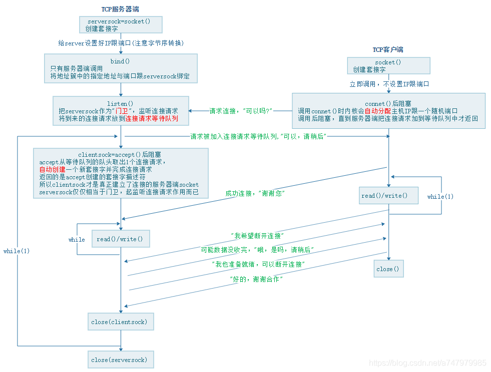

Lwip：这东西太复杂了([了解](https://www.cnblogs.com/qinzhou/p/8376457.html))，对协议栈的封装，后续再研究吧

1. 应用层协议：应用层定义了各种各样的协议来规范数据格式，常见的有 HTTP、FTP、SMTP 等，HTTP 是一种比较常用的应用层协议。可以通过端口号知道收发数据的是那个应用程序。
2. 传输层协议：决定传输方式。TCP协议，就像有根传送带，让数据传输非常可靠且有顺序，而且读写没有数据边界(通过I/Obuffer的帮助，可以任意次写也能任意次读)。UDP就像用运输摩托，非常高效，只管发送，不管顺序，不管是否送到，有数据边界(一次只能送摩托容量的数据)
3. 网络层协议：通过IP协议确定路径，根据IP可以确定网络地址(C类IP前24位)，后8位为主机地址。根据ARP协议可知道同一子网下IP地址对应的MAC地址即以太网地址，缓存在路由器跟主机的ARP表中。路由协议则是可以通过网关借助路由器实现不同子网中的通信
4. 链路层协议：对电信号进行分组并形成具有特定意义的数据帧，然后以广播的形式通过物理介质发送给接收方。以太网规协议定，接入网络的设备都必须安装网络适配器，即网卡， 数据包必须是从一块网卡传送到另一块网卡，所以才需要以太网(MAC)地址

在Lab 6中，如果是httpd环境接收数据，那么input helper 环境从RX ring中取出数据包(此时的数据包是链路层分组出的数据帧，有着TCP头部、IP头部、以太网头部)，通过NSREQ_INPUT IPC消息发给network server环境，由NS环境调用lwip代码对数据包进行"解包装"，一层一层验证、获取信息、并去掉这些头部，知道最后只剩符合http格式的数据后存在socket的netbuf中，等待httpd环境通过NSREQ_RECV IPC消息获取。

如果是发数据，就由httpd环境通过NSREQ_SEND IPC消息将数据存到socket的netbuf中，由NS 环境调用lwip代码对其进行"加包装"，一层一层的添加头部，直到变成符合链路层发送的数据帧，通过NSREQ_OUTPUT IPC消息发给output helper 环境，由其放入到TX ring中，等待网卡进行发送

### Part A: Initialization and transmitting packets


##### Exercise 1

``` c
@@ -252,4 +252,10 @@ trap_dispatch(struct Trapframe *tf)
        case IRQ_OFFSET + IRQ_TIMER:
                lapic_eoi();
+               // Add time tick increment to clock interrupts.
+               // Be careful! In multiprocessors, clock interrupts are
+               // triggered on every CPU.
+               if (thiscpu->cpu_id == 0) {
+                       time_tick();
+               }
                sched_yield();
                return;

// Return the current time.
static int
sys_time_msec(void)
{
    return time_msec();
}

case SYS_time_msec:
    return sys_time_msec();

```


#### PCI Interface

#####  Exercise 3

PCI是外围设备互连(Peripheral Component Interconnect)的简称，是在目前计算机系统中得到广泛应用的通用总线接口标准：

    在一个PCI系统中，最多可以有256根PCI总线，一般主机上只会用到其中很少的几条。
    在一根PCI总线上可以连接多个物理设备，可以是一个网卡、显卡或者声卡等，最多不超过32个。
    一个PCI物理设备可以有多个功能，比如同时提供视频解析和声音解析，最多可提供8个功能。
    每个功能对应1个256字节的PCI配置空间。
``` c
static void
pci_conf1_set_addr(uint32_t bus,
                   uint32_t dev,
                   uint32_t func,
                   uint32_t offset)
{
     assert(bus < 256);      //8位 最多可以有256根PCI总线，一般主机上只会用到其中很少的几根
     assert(dev < 32);       //5位 一根PCI总线可以连接多个物理设备，可以是一个网卡、显卡或声卡等，最多不超过32个
     assert(func < 8);       //3位 一个PCI物理设备可以有多个功能，比如同时提供视频解析和声音解析，最多可提供8个功能。
     assert(offset < 256);   //8位 每个功能对应1个256字节的PCI配置空间。
     assert((offset & 0x3) == 0);//最后两位必须为00？

     uint32_t v = (1 << 31) |                // config-space
             (bus << 16) | (dev << 11) | (func << 8) | (offset);
     outl(pci_conf1_addr_ioport, v);
}
```


``` c
// 在5.2节的表中找到82540EM对应的VENDOR_ID跟DEVICE_ID
// e1000.h
#define E1000_VEN_ID            0x8086
#define E1000_DEV_ID_82540EM    0x100E

// e10000.c
int
e1000_attach(struct pci_func *pcif)
{
    pci_func_enable(pcif);
    return 0;
}

// pci.c
@@ -33,3 +33,4 @@ struct pci_driver pci_attach_class[] = {
 struct pci_driver pci_attach_vendor[] = {
+       { E1000_VEN_ID, E1000_DEV_ID_82540EM, &e1000_attach },
        { 0, 0, 0 },
 };


```


#### Memory-mapped I/O


##### Exercise 4

``` c
// e1000.c
volatile void *e1000_base;

int
e1000_attach(struct pci_func *pcif)
{
    pci_func_enable(pcif);
    e1000_base = mmio_map_region(pcif->reg_base[0], pcif->reg_size[0]);

    return 0;
}

// e1000.h
#define E1000_STATUS    0x00008  /* Device Status - RO */


```

#### Transmitting Packets


##### Exercise 5

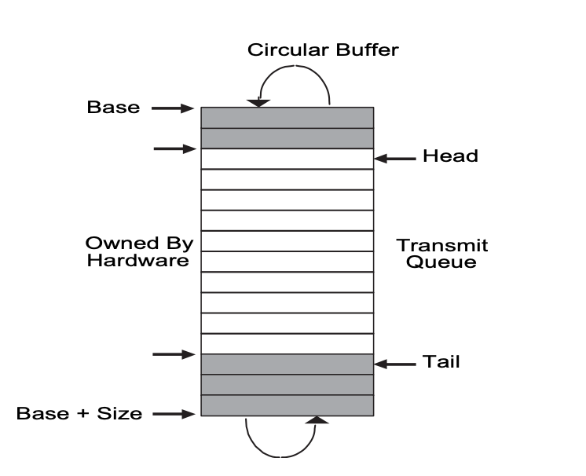

初始化步骤如下

* 为transmit descriptor list(`循环数组`)分配一块内存区域。(`TDBAL/TDBAH`)指向这段区域的`物理地址`
* 设置 Transmit Descriptor Length (`TDLEN`) register为这个描述符循环数组的大小，以字节为单位
* 初始化 Transmit Control Register(`TCTL`) 。设置TCTL.EN=1b，TCTL.PSP=1b，TCTL.CT=10h，TCTL.COLD假设全双工下=40h
* 编写 Transmit IPG (`TIPG`) register

``` c
// e1000.h 
// copy from e1000_hw.h
#define E1000_TCTL     0x00400  /* TX Control - RW */
#define E1000_TIPG     0x00410  /* TX Inter-packet gap -RW */
#define E1000_TDBAL    0x03800  /* TX Descriptor Base Address Low - RW */
#define E1000_TDBAH    0x03804  /* TX Descriptor Base Address High - RW */
#define E1000_TDLEN    0x03808  /* TX Descriptor Length - RW */
#define E1000_TDH      0x03810  /* TX Descriptor Head - RW */
#define E1000_TDT      0x03818  /* TX Descripotr Tail - RW */

/* Transmit Control */
#define E1000_TCTL_EN   0x00000002  /* enable tx */
#define E1000_TCTL_PSP  0x00000008  /* pad short packets */
#define E1000_TCTL_CT   0x00000ff0  /* collision threshold */
#define E1000_TCTL_COLD 0x003ff000  /* collision distance */

/* Collision related configuration parameters */
#define E1000_COLLISION_THRESHOLD   0x10
#define E1000_CT_SHIFT              4  /*前面是0~4 参考Table 13-76 */

/* Collision distance is a 0-based value that applies to half-duplex-capable hardware only. */
#define E1000_COLLISION_DISTANCE    0x40
#define E1000_COLD_SHIFT            12 /*前面是0~12 参考Table 13-76*/

/* Default values for the transmit IPG register */
#define E1000_DEFAULT_TIPG_IPGT     10
#define E1000_DEFAULT_TIPG_IPGR1    4
#define E1000_DEFAULT_TIPG_IPGR2    6
#define E1000_TIPG_IPGT_MASK        0x000003FF /*0~9位*/
#define E1000_TIPG_IPGR1_MASK       0x000FFC00 /*10~19位*/
#define E1000_TIPG_IPGR2_MASK       0x3FF00000 /*20~29位*/
#define E1000_TIPG_IPGR1_SHIFT      10 /*前面0~10位参考Table 13-77*/
#define E1000_TIPG_IPGR2_SHIFT      20 /*前面0~20位参考Table 13-77*/

// e1000.c
#define TX_BUF_SIZE 1536  // 16-byte aligned for performance
#define NTXDESC     64

static struct e1000_tdesc e1000_tx_queue[NTXDESC] __attribute__((aligned(16)));
static uint8_t e1000_tx_buf[NTXDESC][TX_BUF_SIZE];


struct e1000_tdesc{
  uint64_t addr;
  uint16_t length;
  uint8_t cso;
  uint8_t cmd;
  uint8_t status;
  uint8_t css;
  uint16_t special;
}__attribute__((packed));

static void
e1000_tx_init()
{
    // initialize tx queue
    int i;
    memset(e1000_tx_queue, 0, sizeof(e1000_tx_queue));
    for (i = 0; i < NTXDESC; i++) {
        e1000_tx_queue[i].addr = PADDR(e1000_tx_buf[i]);
    }

    // initialize transmit descriptor registers
    E1000_REG(E1000_TDBAL) = PADDR(e1000_tx_queue);
    E1000_REG(E1000_TDBAH) = 0;
    E1000_REG(E1000_TDLEN) = sizeof(e1000_tx_queue);
    E1000_REG(E1000_TDH) = 0;
    E1000_REG(E1000_TDT) = 0;

    // initialize transmit control registers
    E1000_REG(E1000_TCTL) &= ~(E1000_TCTL_CT | E1000_TCTL_COLD);
    E1000_REG(E1000_TCTL) |= E1000_TCTL_EN | E1000_TCTL_PSP |
                            (E1000_COLLISION_THRESHOLD << E1000_CT_SHIFT) |
                            (E1000_COLLISION_DISTANCE << E1000_COLD_SHIFT);
    E1000_REG(E1000_TIPG) &= ~(E1000_TIPG_IPGT_MASK | E1000_TIPG_IPGR1_MASK | E1000_TIPG_IPGR2_MASK);
    E1000_REG(E1000_TIPG) |= E1000_DEFAULT_TIPG_IPGT |
                            (E1000_DEFAULT_TIPG_IPGR1 << E1000_TIPG_IPGR1_SHIFT) |
                            (E1000_DEFAULT_TIPG_IPGR2 << E1000_TIPG_IPGR2_SHIFT);
}

int
e1000_attach(struct pci_func *pcif)
{
    pci_func_enable(pcif);
    e1000_base = mmio_map_region(pcif->reg_base[0], pcif->reg_size[0]);

    e1000_tx_init();

    return 0;
}

```


##### Exercise 6

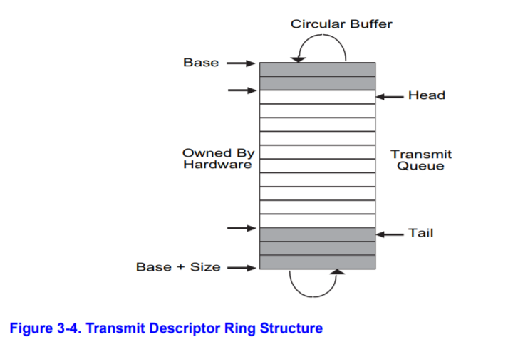

下一个被transimit的在TDT register处。检查status field，以确定状态是unused 还是 reused。当transmit 一个 packet，设置RS在command field。当E1000 NIC已经transmitted 这个 packet，会设置DD bit在status，意味着这个discriptor可以被reused。如果一个descriptor 从未被使用，RS位为0。传输持续进行，直到head == tail，这时队列是空的。TDH，表示in-process的descriptor。TDT，hardware可以process的最后一个位置之后，也是软件可以写入的第一个descriptor

``` c
// e1000.h
/* Transmit Descriptor bit definitions */
#define E1000_TXD_CMD_EOP   0x01  /* End of Packet */
#define E1000_TXD_CMD_RS    0x08  /* Report Status */
#define E1000_TXD_STAT_DD   0x01  /* Descriptor Done */

// e1000.c
int
e1000_transmit(const void *buf, size_t size)
{
    int tail = E1000_REG(E1000_TDT);

    if (size > ETH_PKT_SIZE) {
        return -E_PKT_TOO_LARGE;
    }
  // check the descriptor is free
    if ((e1000_tx_queue[tail].cmd & E1000_TXD_CMD_RS) && !(e1000_tx_queue[tail].status & E1000_TXD_STAT_DD)) {
        return -E_TX_FULL;
    }

    e1000_tx_queue[tail].status &= ~E1000_TXD_STAT_DD;
    memcpy(e1000_tx_buf[tail], buf, size);
    e1000_tx_queue[tail].length = size;
    e1000_tx_queue[tail].cmd |= E1000_TXD_CMD_RS | E1000_TXD_CMD_EOP;
    // move to next
    E1000_REG(E1000_TDT) = (tail + 1) % NTXDESC;

    return 0;
}

// e1000.c:e1000_attach()
char *str = "hello";
e1000_transmit(str, 6);

```

##### Exercise 7

``` c
// kern/syscall.c
// Transmit a packet from user space
//
// Return 0 on success, < 0 on error.  Errors are:
//  -E_E_PKT_TOO_LARGE if packet size exceeds tx buffer size (1536 bytes).
//  -E_TX_FULL if tx queue is full.
static int
sys_net_send(const void* buf, size_t size)
{
    // segfault when address of buf is invalid
    user_mem_assert(curenv, buf, size, PTE_U);
    return e1000_transmit(buf, size);
}

```

#### Transmitting Packets: Network Server


##### Exercise 8

``` c
void
output(envid_t ns_envid)
{
    binaryname = "ns_output";

    uint32_t req, whom;
    int r;

    while (1) {
        // read a packet from the network server
        req = ipc_recv((int32_t *) &whom, &nsipcbuf, NULL);

        // ignore non-NSREQ_OUTPUT IPC requests
        if (req != NSREQ_OUTPUT) {
            continue;
        }

        // send the packet to the device driver
        // if tx queue is full, simply wait
        while ((r = sys_net_send(nsipcbuf.pkt.jp_data, nsipcbuf.pkt.jp_len)) == -E_TX_FULL) {
            sys_yield();
        }

        if (r < 0) {
            // ignore oversized packets
            if (r == -E_PKT_TOO_LARGE) {
                cprintf("%s: packet too large (%d bytes), ingored\n", binaryname, nsipcbuf.pkt.jp_len);
                continue;
            } else {
                panic("%s: sys_net_send(): unexpected return value %d", binaryname, r);
            }
        }
    }
}

```

###### Question 1

发送ring满时，程序放弃控制直到有空的空间

### Part B: Receiving packets and the web server

#### Receiving Packets


##### Exercise 10

``` c
// e1000.h
struct e1000_rx_desc {
    uint64_t addr;
    uint16_t length;
    uint16_t chksum;
    uint8_t status;
    uint8_t err;
    uint16_t special;
} __attribute__((packed));

#define E1000_RDBAL    0x02800  /* RX Descriptor Base Address Low - RW */
#define E1000_RDBAH    0x02804  /* RX Descriptor Base Address High - RW */
#define E1000_RDLEN    0x02808  /* RX Descriptor Length - RW */
#define E1000_RDH      0x02810  /* RX Descriptor Head - RW */
#define E1000_RDT      0x02818  /* RX Descriptor Tail - RW */

/* Receive Control */
#define E1000_RCTL_EN       0x00000002  /* enable */
#define E1000_RCTL_LBM      0x000000c0  /* loopback mode */
#define E1000_RCTL_RDMTS    0x00000300  /* rx desc min threshold size */
#define E1000_RCTL_SZ       0x00030000  /* rx buffer size */
#define E1000_RCTL_SECRC    0x04000000  /* strip ethernet CRC */
#define E1000_RCTL_BSEX     0x02000000  /* Buffer size extension */

#define E1000_RCTL_LBM_NO       0x00000000  /* no loopback mode */
#define E1000_RCTL_LBM_SHIFT    6

#define E1000_RCTL_RDMTS_HALF   0x00000000
#define E1000_RCTL_RDMTS_SHIFT  8

#define E1000_RCTL_SZ_2048      0x00000000  /* rx buffer size 2048 */
#define E1000_RCTL_SZ_SHIFT     16

#define E1000_RAH_AV              0x80000000    /* Receive descriptor valid */ 
#define E1000_RAL                 0x05400
#define E1000_RAH                 0x05404

// e1000.c
#define RX_BUF_SIZE 2048
#define NRXDESC     128

static struct e1000_rx_desc e1000_rx_queue[NRXDESC] __attribute__((aligned(16)));
static uint8_t e1000_rx_buf[NRXDESC][RX_BUF_SIZE];


#define JOS_DEFAULT_MAC_LOW     0x12005452
#define JOS_DEFAULT_MAC_HIGH    0x00005634

static void
e1000_rx_init()
{
    // initialize rx queue
    int i;
    memset(e1000_rx_queue, 0, sizeof(e1000_rx_queue));
    for (i = 0; i < NRXDESC; i++) {
        e1000_rx_queue[i].addr = PADDR(e1000_rx_buf[i]);
    }

    // initialize receive address registers
    // by default, it comes from EEPROM
    E1000_REG(E1000_RAL) = JOS_DEFAULT_MAC_LOW;
    E1000_REG(E1000_RAH) = JOS_DEFAULT_MAC_HIGH;
    E1000_REG(E1000_RAH) |= E1000_RAH_AV;

    // initialize receive descriptor registers
    E1000_REG(E1000_RDBAL) = PADDR(e1000_rx_queue);
    E1000_REG(E1000_RDBAH) = 0;
    E1000_REG(E1000_RDLEN) = sizeof(e1000_rx_queue);
    E1000_REG(E1000_RDH) = 0;
  	
  // DPDK e1000 drive
   	/*
	 * If the number of free RX descriptors is greater than the RX free
	 * threshold of the queue, advance the Receive Descriptor Tail (RDT)
	 * register.
	 * Update the RDT with the value of the last processed RX descriptor
	 * minus 1, to guarantee that the RDT register is never equal to the
	 * RDH register, which creates a "full" ring situtation from the
	 * hardware point of view...
	 */
    E1000_REG(E1000_RDT) = NRXDESC - 1;

    // initialize transmit control registers
    E1000_REG(E1000_RCTL) &= ~(E1000_RCTL_LBM | E1000_RCTL_RDMTS | E1000_RCTL_SZ | E1000_RCTL_BSEX);
    E1000_REG(E1000_RCTL) |= E1000_RCTL_EN | E1000_RCTL_SECRC;
}

```

##### Exercise 11

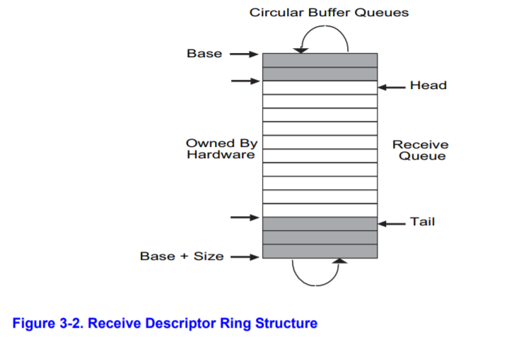

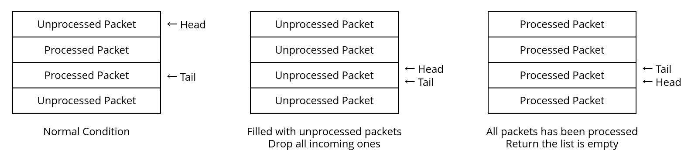

RDH 是最后一个unprocessed packet，即最后一个收到的packer。RDT是最后一个processed packet（empty buffer）。当RDH caught up到RDT，意味着队列满了，都是unprocessed packets，NIC会丢弃incoming 的 frame直到有buffer中的packet processed。相反的，当RDT caught up 到RDH，所有的packets 已经被processed，返回一个error，告诉队列空了

packet是否被处理由其描述符的 DD 位表示。当E1000收到一个packet，将被设置DD位，因此，我们需要清除 DD 位，并在读取后向前移动RDT，告诉 NIC 这个缓冲区可以重用于传入的数据包。第一个要处理的数据包是RDT指向的下一个数据包。RDT跟踪着下一个received packet

``` c
int
e1000_receive(void *buf, size_t size)
{
    int tail = E1000_REG(E1000_RDT);
    int next = (tail + 1) % NRXDESC;
    int length;

    if (!(e1000_rx_queue[next].status & E1000_RXD_STAT_DD)) {
        return -E_RX_EMPTY;
    }

    if ((length = e1000_rx_queue[next].length) > size) {
        return -E_PKT_TOO_LARGE;
    }

    memcpy(buf, e1000_rx_buf[next], length);
    e1000_rx_queue[next].status &= ~E1000_RXD_STAT_DD;

    E1000_REG(E1000_RDT) = next;

    return length;
}

// Receive a packet from network in user space
//
// Return 0 on success, < 0 on error.  Errors are:
//  -E_E_PKT_TOO_LARGE if packet size exceeds buffer size.
//  -E_RX_EMPTY if no packet is received.
static int
sys_net_recv(void* buf, size_t size)
{
    // segfault when address of buf is invalid
    user_mem_assert(curenv, buf, size, PTE_U);
    return e1000_receive(buf, size);
}

```

#### Receiving Packets: Network Server


##### Exercise 12

``` c
#define INPUT_BUFSIZE  2048

// 不加或sleep时间少的时候，会提示少几个包 
// 如果实现了第二种方法，调用挂起环境，避免内容被覆盖，则可以不用sleep，留到以后吧
void sleep(int msec){
  unsigned now = sys_time_msec(); 
  unsigned end = now + msec;

  if((int)now < 0 && (int)now > -MAXERROR){
    panic("sys_time_msec: %e", (int)now);  
  }

  if(end < now){
    panic("sleep: wrap");
  }

  while(sys_time_msec() < end){
    sys_yield();
  }
} 

void
input(envid_t ns_envid)
{
    binaryname = "ns_input";

    uint8_t inputbuf[INPUT_BUFSIZE];
    int r, i;

    while (1) {
        // clear the buffer
        memset(inputbuf, 0, sizeof(inputbuf));

        // read a packet from the device driver
        while ((r = sys_net_recv(inputbuf, sizeof(inputbuf))) == -E_RX_EMPTY) {
            sys_yield();
        }

        // panic if inputbuf is too small
        if (r < 0) {
            panic("%s: inputbuf too small", binaryname);
        }

        // send it to the network server
        nsipcbuf.pkt.jp_len = r;
        memcpy(nsipcbuf.pkt.jp_data, inputbuf, r);
        ipc_send(ns_envid, NSREQ_INPUT, &nsipcbuf, PTE_P | PTE_U);

        // Hint: When you IPC a page to the network server, it will be
        // reading from it for a while, so don't immediately receive
        // another packet in to the same physical page.
        sys_yield();
      
      	sleep(50);
    }
}

```

###### Question 2

返回一个E_RX_EMPTY error

#### The Web Server

##### Exercise 13

``` c
static int
send_file(struct http_request *req)
{
    int r;
    struct Stat stat;
    int fd;

    // open the requested url for reading
    // if the file does not exist, send a 404 error using send_error
    // if the file is a directory, send a 404 error using send_error
    // set file_size to the size of the file
    fd = open(req->url, O_RDONLY);
    if (fd < 0) {
        return send_error(req, 404);
    }

    if ((r = fstat(fd, &stat)) < 0)
        goto end;

    if (stat.st_isdir) {
        close(fd);
        return send_error(req, 404);
    }

    if ((r = send_header(req, 200)) < 0)
        goto end;

    if ((r = send_size(req, stat.st_size)) < 0)
        goto end;

    if ((r = send_content_type(req)) < 0)
        goto end;

    if ((r = send_header_fin(req)) < 0)
        goto end;

    r = send_data(req, fd);

end:
    close(fd);
    return r;
}

static int
send_data(struct http_request *req, int fd)
{
    int r;
    char buf[BUFFSIZE];

    while ((r = read(fd, buf, BUFFSIZE)) > 0) {
        if (write(req->sock, buf, r) != r) {
            die("Failed to send bytes to client");
        }
    }

    return 0;
}

```

